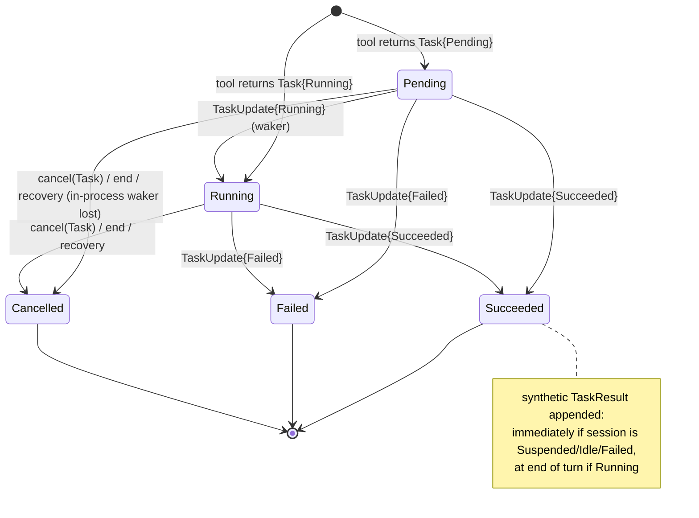

# Kernel interface specification

- **Status:** approved at v0.1 (2026-09-06); implementation clarifications are marked **[clarified in P1.x]**
- **Version:** 0.1
- **Date:** 2026-09-06
- **Milestone:** P1.0 (D20). Implemented by P1.1 (types), P1.2 (loop), P1.3 (event log, checkpoints), P1.4 (record/replay).
- **Companion specs:** [`event-schema.md`](./event-schema.md) (envelope, every event kind, hash and volatile-field definitions), [`profile-schema.md`](./profile-schema.md) (TOML profiles, bundles, merge rules, validator).

---

## 1. Purpose and rules

This document is the public surface of the `kernel` crate, written as Rust signatures. Per D20, agents implement Phase 1 against these signatures, not against prose. The rules:

1. **P1.1–P1.4 implement exactly the signatures in §3.** Renaming a type, adding or removing a field, changing a trait method's arguments or return type, or changing a documented semantic in §4–§7 is a spec change. A spec change lands in the **same PR** as the code that needs it, with a `docs/specs/` diff the reviewer can read first (CONTRIBUTING.md, "Conventions").
2. **Later phases must fit without kernel changes.** The types below were checked against P2.4 (spawn), P2.5 (artifact store), P2.6 (compaction), P2.7 (memory), P2.9 (context budget), P3.1 (provenance projector), P3.4 (wakers, trust tiers) and P4 (harness edits). Where a later phase needs a slot, the slot exists now as a reserved type, field, or event kind. The kernel soft-freezes at P1 exit and hard-freezes at P2 exit (D12); after P1 exit every change here needs an ADR.
3. **The kernel depends on nothing in-repo** (`crates/README.md`, enforced by `crates/kernel/tests/no_in_repo_deps.rs`). Everything here is defined in `kernel`; `providers`, `host`, `ext`, `profiles`, `sandbox`, `orchestrator`, `provenance` implement or consume it.
4. **Normative language.** MUST / MUST NOT / SHOULD / MAY are used per RFC 2119. A MUST that is not covered by a test at the milestone that implements it is not done (IMPLEMENTATION_PLAN.md, "Nothing is promoted on faith").
5. **Decisions D1–D20 are cited inline** as `(Dn)`. Where this spec decides something D1–D20 do not literally settle, the paragraph is marked **[decided here]** so the reviewer can focus on those; they are collected in §10.

---

## 2. Conventions

Shared with `profile-schema.md`; both specs use these verbatim.

- Crate `kernel`, Rust 2024 edition, toolchain 1.94.1 (pinned), `#![forbid(unsafe_code)]` (workspace lint), `missing_docs = "warn"`.
- Async traits via `#[async_trait::async_trait]` (D4). Every trait object below is `Send + Sync` and is held as `Arc<dyn Trait>`.
- Errors via `thiserror`. Every public fallible operation has its own error enum; no `Box<dyn Error>` in signatures except inside an `Internal(#[source] Box<dyn std::error::Error + Send + Sync>)` variant.
- Serialization via `serde` + `serde_json`. Every type that can appear in `State` or in an event payload derives `Serialize, Deserialize, Clone, Debug, PartialEq` and uses `#[serde(rename_all = "snake_case")]` on enums. Enum tagging is stated per type.
- Hash strings are `b3:<64 lowercase hex>` (D3). Canonicalization is RFC 8785 (JCS); see `event-schema.md` §3.
- Time on the wire is an RFC 3339 UTC string with millisecond precision, `2026-09-06T12:34:56.789Z`. `Duration` fields serialize as integer seconds unless stated (`_secs` suffix on the wire) or milliseconds (`_ms` suffix).
- Third-party dependencies the kernel MAY take: `tokio`, `tokio-util` (`CancellationToken`), `serde`, `serde_json`, `thiserror`, `async-trait`, `blake3`, `futures-core` (`Stream`), `regex` (redactor), and one JCS canonicalizer chosen by P1.1 (`serde_jcs` or equivalent). Nothing else without a note in the P1.1 PR. **[clarified in P1.1]** P1.1 chose an in-crate canonicalizer over `serde_json::Value` with `ryu-js` for ECMAScript number formatting (`event-schema.md` §3.8 test vectors pass), `serde_json` with the `float_roundtrip` feature (its default parser is not correctly rounded, which the RFC 8785 vectors expose), and `proptest` as a dev-dependency for the `Capability` property tests.

---

## 3. Signatures

Every block below is intended to compile once the listed dependencies exist. Doc comments are abbreviated; the implementation MUST carry full doc comments (workspace lint).

### 3.1 Identifiers and `Hash`

```rust
use serde::{Deserialize, Serialize};

/// BLAKE3 over RFC 8785 canonical JSON, rendered as `b3:<64 lowercase hex>` (D3).
#[derive(Clone, Debug, PartialEq, Eq, Hash, PartialOrd, Ord, Serialize, Deserialize)]
#[serde(transparent)]
pub struct Hash(String);

impl Hash {
    /// Hash the canonical JSON (RFC 8785) of `value`.
    /// Errors if `value` contains a non-finite float or a map with non-string keys.
    pub fn of_canonical_json<T: Serialize + ?Sized>(value: &T) -> Result<Hash, HashError>;
    /// Hash raw bytes (used for `raw_response_hash` and artifact content addressing).
    pub fn of_bytes(bytes: &[u8]) -> Hash;
    /// Parse a `b3:<hex>` string; rejects any other algorithm prefix or length.
    pub fn parse(s: &str) -> Result<Hash, HashError>;
    pub fn as_str(&self) -> &str;
}

#[derive(Debug, thiserror::Error)]
pub enum HashError {
    #[error("value is not canonicalizable: {0}")]
    NotCanonicalizable(String),           // non-finite float, non-string map key
    #[error("serialization failed: {0}")]
    Serialize(#[from] serde_json::Error),
    #[error("malformed hash string: {0}")]
    Malformed(String),
}

/// Canonical JSON bytes (RFC 8785). Exposed so tests and `diff-logs` share one implementation.
pub fn canonical_json<T: Serialize + ?Sized>(value: &T) -> Result<Vec<u8>, HashError>;

/// Opaque session identifier. The launcher chooses it (UUIDv7 recommended); the kernel never parses it.
#[derive(Clone, Debug, PartialEq, Eq, Hash, PartialOrd, Ord, Serialize, Deserialize)]
#[serde(transparent)]
pub struct SessionId(pub String);

/// Kernel crate version, written into `log_opened`, `session_created`, `resumed`, `recovered`.
pub const KERNEL_VERSION: &str = env!("CARGO_PKG_VERSION");
/// Bumped when `State`'s serialized shape changes; see §3.4 migrations.
pub const STATE_SCHEMA_VERSION: u32 = 1;
/// Bumped when the event envelope or any payload changes incompatibly; see `event-schema.md` §1.
pub const EVENT_SCHEMA_VERSION: u32 = 1;
```

### 3.2 `Capability`, `FsMode`, `NetAllow`, `narrower_than`

Typed atoms (D6). Bundles (`meshing`, `solver`, `post`) are a `profiles` concept and are expanded to atoms before anything reaches the kernel; the kernel never sees a bundle name.

```rust
use std::collections::BTreeSet;
use std::path::PathBuf;

#[derive(Clone, Copy, Debug, PartialEq, Eq, PartialOrd, Ord, Serialize, Deserialize)]
#[serde(rename_all = "snake_case")]
pub enum FsMode { Ro, Rw }

#[derive(Clone, Debug, PartialEq, Eq, Serialize, Deserialize)]
#[serde(rename_all = "snake_case")]
pub enum NetAllow {
    Any,
    /// Host names (optionally `host:port`), compared case-insensitively after ASCII lowercasing.
    Hosts(BTreeSet<String>),
}

/// A capability atom (D6). Serialized form in JSON is the canonical string (see `Display`),
/// e.g. `"fs.rw:/work/repo"`, so logs and TOML profiles read the same way.
#[derive(Clone, Debug, PartialEq, Eq, PartialOrd, Ord, Serialize, Deserialize)]
#[serde(try_from = "String", into = "String")]
pub enum Capability {
    /// `fs.ro:<abs-path>` / `fs.rw:<abs-path>`. Path MUST be absolute, normalized, and contain no `..`.
    Fs { path: PathBuf, mode: FsMode },
    /// `net:*` / `net:<host>[,<host>...]`
    Net { allow: NetAllow },
    /// `proc:<program>` — program name or absolute path the tool may execute (e.g. `proc:sbatch`).
    Proc { program: String },
    /// `tool:<name>` — the tool may be invoked / registered.
    Tool { name: String },
    /// `spawn:<catalog-name>` — the agent may spawn this catalog entry as a sub-agent (P2.4).
    Spawn { catalog_name: String },
    /// `secret:<name>` — a provider client may resolve this secret (D10). Never reaches a sandbox.
    Secret { name: String },
}

impl std::fmt::Display for Capability { /* canonical string form above */ }
impl std::str::FromStr for Capability { type Err = CapabilityParseError; /* inverse of Display */ }
impl TryFrom<String> for Capability { type Error = CapabilityParseError; }
impl From<Capability> for String {}

#[derive(Debug, thiserror::Error)]
pub enum CapabilityParseError {
    #[error("unknown capability prefix in `{0}`")]
    UnknownPrefix(String),
    #[error("fs path must be absolute, normalized, without `..`: `{0}`")]
    BadPath(String),
    #[error("empty name in `{0}`")]
    EmptyName(String),
}

impl Capability {
    /// Partial order. Reflexive. Atoms of different variants are never comparable (returns false).
    ///
    /// - `Fs`: `self.path` equals or is under `other.path` component-wise (after normalization,
    ///   no `..`), AND `self.mode <= other.mode` where `Ro <= Ro`, `Ro <= Rw`, `Rw <= Rw`.
    /// - `Net`: `Hosts(a) <= Hosts(b)` iff every host of `a` is covered by a host of `b` (equal, or
    ///   `a`'s host carries a port and `b`'s is the same host without one, per `profile-schema.md`
    ///   §11.4); anything `<= Any`; `Any <= Any` only. Normalization drops a `host:port` whose bare
    ///   `host` is also listed, so the order is antisymmetric up to normalization. **[clarified in P1.1]**
    /// - `Proc`, `Tool`, `Spawn`, `Secret`: exact name equality.
    pub fn narrower_than(&self, other: &Capability) -> bool;

    /// True iff some element of `grants` is wider than or equal to `self`.
    pub fn covered_by(&self, grants: &[Capability]) -> bool;

    /// Normalize an `Fs` path: reject relative paths and `..`; collapse `.` and duplicate separators.
    /// Symlinks are NOT resolved here (pure function); the sandbox resolves them at mount time.
    pub fn normalize_path(path: &std::path::Path) -> Result<PathBuf, CapabilityParseError>;
}
```

Property tests required by P1.1: reflexivity; transitivity across `Fs` prefix chains and `Net` subset chains; antisymmetry up to equality; `Fs` with `Rw` is never narrower than `Ro` at the same path; a path that is a *string* prefix but not a *component* prefix (`/work/repo2` vs `/work/repo`) is not narrower; `Any` is narrower only than `Any`.

### 3.3 Content blocks and messages

Content blocks per D15; tagged by `"type"`.

```rust
use serde_json::Value;

#[derive(Clone, Debug, PartialEq, Serialize, Deserialize)]
#[serde(tag = "type", rename_all = "snake_case")]
pub enum ContentBlock {
    Text { text: String },
    /// Reasoning content. `signature` is an opaque provider token that must round-trip if present.
    Thinking { text: String, signature: Option<String> },
    ToolUse { id: String, name: String, input: Value },
    ToolResult { tool_use_id: String, content: ToolResultContent, is_error: bool },
    /// Bytes live in the artifact store; the provider encodes them at request time (D15).
    Image { artifact_handle: ArtifactHandle, mime: String },
    /// Synthetic completion of a `Task` (D1), appended by the kernel, never by a tool. **[decided here]**
    /// Providers render it as the wire format allows (for OpenAI-compatible endpoints: a user-role
    /// text message containing the JSON of this block), because a late tool_result for an old
    /// tool_use id is rejected by most chat APIs.
    TaskResult {
        task_id: TaskId,
        tool_use_id: String,
        status: TaskStatus,           // Succeeded | Failed | Cancelled
        content: ToolResultContent,
        is_error: bool,
    },
}

/// Externally tagged: `{"blocks": [...]}` or `{"json": ...}` (an untagged union would be ambiguous). **[decided here]**
#[derive(Clone, Debug, PartialEq, Serialize, Deserialize)]
#[serde(rename_all = "snake_case")]
pub enum ToolResultContent {
    Blocks(Vec<ContentBlock>),   // Text and Image only; nested ToolUse/ToolResult are rejected on validation
    Json(Value),
}

#[derive(Clone, Copy, Debug, PartialEq, Eq, Serialize, Deserialize)]
#[serde(rename_all = "snake_case")]
pub enum Role { System, User, Assistant, Tool }

/// One conversation message. No timestamps, ids, or other volatile data: `Message` is hashed as part of `State`.
#[derive(Clone, Debug, PartialEq, Serialize, Deserialize)]
pub struct Message {
    pub role: Role,
    pub content: Vec<ContentBlock>,
}

/// One block of the assembled system prompt (D7). Order is fixed by `profiles`; the kernel concatenates.
#[derive(Clone, Debug, PartialEq, Serialize, Deserialize)]
pub struct PromptBlock {
    pub kind: PromptBlockKind,
    /// Source name (profile name, skill name, `AGENTS.md` path, notebook path).
    pub name: String,
    pub text: String,
    /// Content hash of `text`; logged in `profile_load` and `model_request`.
    pub hash: Hash,
}

#[derive(Clone, Copy, Debug, PartialEq, Eq, Serialize, Deserialize)]
#[serde(rename_all = "snake_case")]
/// D7 block order; names match `profile-schema.md` §8. `Skills` may appear once per active skill.
pub enum PromptBlockKind { Model, Role, AgentsMd, Skills, Notebook }
```

Rules:

- `Role::Tool` messages contain only `ToolResult` blocks and MUST immediately follow the `Assistant` message whose `ToolUse` ids they answer, one `ToolResult` per `ToolUse`, in the same order. The kernel guarantees this invariant (§6); providers rely on it.
- `Role::User` messages contain `Text`, `Image`, and `TaskResult` blocks.
- `Role::System` messages never appear in `State.messages`; the system prompt travels in `ModelRequest.system` and is owned by config, not state (§3.8, **[decided here]**: keeping profile-derived text out of `State` lets the evolve loop fork a checkpoint under a different profile without rewriting the checkpoint).

### 3.4 `State` and migrations

```rust
use std::collections::BTreeMap;

#[derive(Clone, Copy, Debug, PartialEq, Eq, Serialize, Deserialize)]
#[serde(rename_all = "snake_case")]
pub enum SessionStatus { Created, Running, Idle, Suspended, Done, Failed }   // D2

#[derive(Clone, Debug, PartialEq, Eq, Serialize, Deserialize)]
pub struct ActiveProfiles {
    pub model_profile_hash: Hash,
    pub agent_profile_hash: Hash,
    /// Hash of the fully resolved profile (kernel defaults + model + agent + project overrides), D7.
    pub resolved_profile_hash: Hash,
    /// `<workdir>/.grist/agent.toml` when present (`profile-schema.md` layer 3).
    pub project_profile_hash: Option<Hash>,
    /// `profiles/bundles.toml`.
    pub bundles_hash: Option<Hash>,
}

/// The checkpointed session state (§4.2 of the dev plan). Field order is the serialized order.
#[derive(Clone, Debug, PartialEq, Serialize, Deserialize)]
pub struct State {
    /// MUST be the first field. Equals `STATE_SCHEMA_VERSION` for states this build writes.
    pub schema_version: u32,
    /// Volatile (excluded from `state_hash`), see below.
    pub session_id: SessionId,
    /// RFC 3339 UTC. Volatile.
    pub created_at: String,
    /// Number of turns started (incremented at the start of each turn). 0 before the first turn.
    pub turn: u64,
    pub session_status: SessionStatus,
    pub messages: Vec<Message>,
    /// Every task ever started in this session, keyed by id; terminal tasks stay (D1 needs their outcome for provenance).
    pub pending_tasks: BTreeMap<TaskId, Task>,
    pub profiles: ActiveProfiles,
    /// `None` until a `Memory` implementation writes one (P2.7).
    pub memory: Option<MemoryPointer>,
    /// Lab notebook path (P2.6). `None` when the agent profile declares none.
    pub notebook_path: Option<PathBuf>,
    /// Hash of the session envelope policy, `derive_policy_with(grants, grants, limits)` (§3.12). Volatile.
    pub sandbox_policy_hash: Hash,
    /// `SandboxBackend::name()` in use, e.g. `"bwrap"` or `"none"` (D14). Volatile.
    pub sandbox_backend: String,
}

impl State {
    /// `Hash::of_canonical_json` of `self` with the volatile fields removed (D3).
    pub fn state_hash(&self) -> Result<Hash, HashError>;
    /// The volatile field names, in serialized order. `event-schema.md` §3.5 is the canonical, normative list;
    /// this constant MUST match it and a test asserts that `state_hash` ignores exactly these.
    pub const VOLATILE_FIELDS: &'static [&'static str] =
        &["session_id", "created_at", "sandbox_policy_hash", "sandbox_backend"];
    /// Tasks in `Pending` or `Running`.
    pub fn open_tasks(&self) -> impl Iterator<Item = &Task>;
}
```

**Volatile fields [decided here].** `session_id`, `created_at`, `sandbox_policy_hash`, `sandbox_backend` are excluded from the state hash. Justification: they say *where and how* the session ran, not *what the conversation is*; each is recorded separately (`session_created`, `checkpoint.state`, `tool_call.policy_hash`) so provenance loses nothing; excluding them makes the record/replay key `(checkpoint_hash, request_hash)` portable across machines (absolute mount paths differ), across `bwrap`/`none` backends (D14), and across checkpoint forks that get a new session id (P3.6). `turn`, `session_status`, `messages`, `pending_tasks`, `profiles`, `memory`, `notebook_path` are hashed. The canonical list, with the reasoning per field, is owned by `event-schema.md` §3.5.

Migrations run on the raw JSON because an older checkpoint may not deserialize into the current struct:

```rust
/// A single-step migration from `from_version()` to `from_version() + 1`.
pub trait StateMigration: Send + Sync {
    fn from_version(&self) -> u32;
    fn migrate(&self, raw: Value) -> Result<Value, MigrationError>;
}

#[derive(Default)]
pub struct MigrationRegistry { /* BTreeMap<u32, Box<dyn StateMigration>> */ }

impl MigrationRegistry {
    pub fn new() -> Self;
    /// Errors if a migration for the same `from_version` is already registered.
    pub fn register(&mut self, m: Box<dyn StateMigration>) -> Result<(), MigrationError>;
    /// Reads `schema_version` from `raw`, applies migrations in order up to `STATE_SCHEMA_VERSION`,
    /// then deserializes. Fails loudly: a missing step is an error, never a best-effort parse.
    pub fn migrate_to_current(&self, raw: Value) -> Result<Migrated, MigrationError>;
}

pub struct Migrated {
    pub state: State,
    /// `Some((from, to))` if any migration ran; the kernel then logs a `warning{class: "state_migrated"}`.
    pub migrated: Option<(u32, u32)>,
}

#[derive(Debug, thiserror::Error)]
pub enum MigrationError {
    #[error("checkpoint has schema_version {found}, this kernel supports up to {supported}")]
    NewerThanSupported { found: u32, supported: u32 },
    #[error("no migration registered from schema_version {from} (target {to})")]
    MissingStep { from: u32, to: u32 },
    #[error("migration {from}->{} failed: {source}", .from + 1)]
    Failed { from: u32, #[source] source: Box<dyn std::error::Error + Send + Sync> },
    #[error("checkpoint has no integer `schema_version`")]
    NoVersion,
    #[error("migration {from} already registered")]
    Duplicate { from: u32 },
    #[error("state does not deserialize after migration: {0}")]
    Invalid(#[from] serde_json::Error),
}
```

### 3.5 Tasks (D1)

```rust
use std::time::Duration;

#[derive(Clone, Debug, PartialEq, Eq, Hash, PartialOrd, Ord, Serialize, Deserialize)]
#[serde(transparent)]
pub struct TaskId(pub String);

#[derive(Clone, Copy, Debug, PartialEq, Eq, Serialize, Deserialize)]
#[serde(rename_all = "snake_case")]
pub enum TaskStatus { Pending, Running, Succeeded, Failed, Cancelled }

impl TaskStatus {
    pub fn is_terminal(self) -> bool;   // Succeeded | Failed | Cancelled
}

/// What a tool returns to start a task. `check_hint` is for the polling sidecar (P3.4) and is
/// NEVER shown to the model: the kernel strips it before building the "task started" tool result.
#[derive(Clone, Debug, PartialEq, Serialize, Deserialize)]
pub struct TaskHandle {
    /// Obtained from `ToolContext::task_id()`; deterministic per (turn, tool_use_id), see §3.6.
    pub id: TaskId,
    /// `Pending` or `Running` only; a terminal status here is a `ToolError::InvalidTaskHandle`.
    pub status: TaskStatus,
    #[serde(default, with = "crate::serde_util::opt_duration_secs", rename = "eta_secs")]
    pub eta: Option<Duration>,
    /// Opaque to the kernel. E.g. `{"slurm_job_id": "12345"}` or `{"pid": 4242}`.
    pub check_hint: Option<Value>,
    /// One line the model does see, e.g. "sbatch job 12345 (mesh_fine.slurm)".
    pub description: Option<String>,
}

/// Outcome carried by a terminal `TaskUpdate` and copied into the synthetic `TaskResult` block.
#[derive(Clone, Debug, PartialEq, Serialize, Deserialize)]
pub struct TaskOutcome {
    pub content: ToolResultContent,
    pub is_error: bool,
    #[serde(default)]
    pub artifact_handles: Vec<ArtifactHandle>,
}

/// Who delivered a `TaskUpdate`. `trust_tier` is a placeholder until P3.4 (always `None` in P1).
#[derive(Clone, Debug, PartialEq, Serialize, Deserialize)]
pub struct WakerSource {
    /// `"in_process_exit"` (P1), later `"slurm_epilog"`, `"file_watcher"`, `"cron"`, `"webhook"`, `"poll_sidecar"`, `"replay"`.
    pub kind: String,
    pub trust_tier: Option<TrustTier>,
    #[serde(default)]
    pub detail: Value,
}

#[derive(Clone, Copy, Debug, PartialEq, Eq, PartialOrd, Ord, Serialize, Deserialize)]
#[serde(rename_all = "snake_case")]
pub enum TrustTier { Interactive, Scheduled, Inbound }   // ordered: Interactive is most trusted (P3.4)

/// Delivered by a waker (P1: the in-kernel process-exit waker; P3.4: external wakers via the protocol).
#[derive(Clone, Debug, PartialEq, Serialize, Deserialize)]
pub struct TaskUpdate {
    pub id: TaskId,
    pub status: TaskStatus,
    /// Required when `status.is_terminal()`; MUST be `None` otherwise.
    pub outcome: Option<TaskOutcome>,
    #[serde(default, with = "crate::serde_util::opt_duration_secs", rename = "eta_secs")]
    pub eta: Option<Duration>,
    pub check_hint: Option<Value>,
    pub source: WakerSource,
}

/// The record kept in `State.pending_tasks`. No wall-clock fields (it is hashed).
#[derive(Clone, Debug, PartialEq, Serialize, Deserialize)]
pub struct Task {
    pub id: TaskId,
    pub tool_use_id: String,
    pub tool_name: String,
    pub status: TaskStatus,
    pub started_turn: u64,
    /// Turn at which the synthetic result was appended; `None` while open.
    pub completed_turn: Option<u64>,
    #[serde(default, with = "crate::serde_util::opt_duration_secs", rename = "eta_secs")]
    pub eta: Option<Duration>,
    pub check_hint: Option<Value>,
    pub description: Option<String>,
    pub outcome: Option<TaskOutcome>,
    /// `true` when completion depends on a future registered in this process (§3.6 `TaskRegistrar`).
    pub in_process_waker: bool,
}
```

### 3.6 Tools

```rust
use std::sync::Arc;

#[derive(Clone, Copy, Debug, PartialEq, Eq, Serialize, Deserialize)]
#[serde(rename_all = "snake_case")]
pub enum ToolKind {
    /// Fresh sandbox per call; nothing persists between calls (D5).
    Stateless,
    /// One sandboxed process per session; calls are RPC into it (D5).
    Session,
}

/// A tool invocation as extracted from the model response (after the `after_model` chain).
#[derive(Clone, Debug, PartialEq, Serialize, Deserialize)]
pub struct ToolCall {
    pub tool_use_id: String,
    pub name: String,
    pub input: Value,
}

impl ToolCall {
    /// `Hash::of_canonical_json(&self.input)`; the `args_hash` of D13.
    pub fn args_hash(&self) -> Result<Hash, HashError>;
    /// `Hash::of_canonical_json(&self)` (all three fields); the `request_hash` used as the tool
    /// replay key (`event-schema.md` §3.3). Including `tool_use_id` keeps two identical calls in one
    /// turn distinct.
    pub fn request_hash(&self) -> Result<Hash, HashError>;
}

/// What `Tool::invoke` returns. `Blocks` exists so a tool can return `Image` blocks (P2.5) without a
/// post-freeze kernel change. **[decided here]**
#[derive(Clone, Debug, PartialEq, Serialize, Deserialize)]
#[serde(rename_all = "snake_case")]
pub enum ToolResult {
    Value(Value),
    Blocks(Vec<ContentBlock>),
    Task(TaskHandle),
}

#[derive(Debug, thiserror::Error)]
pub enum ToolError {
    /// Input failed the tool's own validation. Becomes an `is_error` result; the turn continues.
    #[error("invalid input: {0}")]
    InvalidInput(String),
    /// The tool ran and failed in a way the model should see. Becomes an `is_error` result.
    #[error("{0}")]
    Failed(String),
    /// Refused by policy (Host path check, sandbox derivation). Becomes an `is_error` result.
    #[error("denied by policy: {0}")]
    Denied(String),
    #[error("timed out after {0:?}")]
    Timeout(Duration),
    /// The cancellation token fired. The kernel handles this on the cancel path (§7.1).
    #[error("cancelled")]
    Cancelled,
    #[error("task handle is invalid: {0}")]
    InvalidTaskHandle(String),
    /// Record/replay cache miss (P1.4); non-recoverable, fails the turn.
    #[error("replay miss for {tool} ({request_hash})")]
    ReplayMiss { tool: String, request_hash: Hash },
    #[error("internal tool error: {0}")]
    Internal(#[source] Box<dyn std::error::Error + Send + Sync>),
}

/// Wire-facing description of a tool, as placed in `ModelRequest.tools`.
#[derive(Clone, Debug, PartialEq, Serialize, Deserialize)]
pub struct ToolDefinition {
    pub name: String,
    pub description: String,
    /// JSON Schema (draft 2020-12) for `ToolCall::input`.
    pub input_schema: Value,
}

#[async_trait::async_trait]
pub trait Tool: Send + Sync {
    /// Unique within a kernel; `[a-z][a-z0-9_.-]*`, at most 64 chars. Dots namespace extension tools
    /// (`mcp.<server>.<tool>`, `ext.<manifest>.<tool>`, `profile-schema.md` §3.3).
    fn name(&self) -> &str;
    fn description(&self) -> &str;
    /// JSON Schema for the input.
    fn schema(&self) -> Value;
    fn kind(&self) -> ToolKind;
    /// Atoms this tool needs (D6). Checked against grants at kernel construction (§7.7).
    fn capabilities(&self) -> Vec<Capability>;
    /// For `ToolKind::Session` tools: the command that starts the long-lived process. The kernel
    /// launches it lazily on first invoke under the derived policy and terminates it on suspend/end.
    /// MUST return `None` for `Stateless`; MUST return `Some` for `Session`.
    fn session_command(&self) -> Option<Command> { None }
    /// Invoke. The kernel applies the policy timeout and cancellation around this call.
    async fn invoke(&self, ctx: &ToolContext<'_>, input: Value) -> Result<ToolResult, ToolError>;

    fn definition(&self) -> ToolDefinition {
        ToolDefinition { name: self.name().to_owned(), description: self.description().to_owned(), input_schema: self.schema() }
    }
}

/// What a tool may see. No secrets: `Host` exposes handles only (§3.9); the resolver is not reachable from here.
pub struct ToolContext<'a> {
    pub host: &'a dyn Host,
    pub cancel: CancellationToken,
    pub session_id: &'a SessionId,
    pub turn: u64,
    pub tool_use_id: &'a str,
    /// Derived policy for THIS tool (§3.12). In-process tools pass `policy.fs()` to Host calls.
    pub policy: &'a SandboxPolicy,
    pub sandbox: &'a dyn SandboxBackend,
    pub artifacts: &'a dyn ArtifactStore,
    /// For `Session` tools: the running process, launched by the kernel. `Err` for `Stateless` tools.
    session: Option<&'a dyn SessionProcess>,
    tasks: &'a dyn TaskRegistrar,
}

impl<'a> ToolContext<'a> {
    pub fn session_process(&self) -> Result<&'a dyn SessionProcess, ToolError>;
    /// Deterministic task id for this invocation: `format!("t{turn}-{tool_use_id}")`. A tool call may
    /// start at most one task. **[decided here]** (deterministic so record/replay and forks agree)
    pub fn task_id(&self) -> TaskId;
    /// Register an in-process completion future (the D1 process-exit waker). The kernel spawns it;
    /// when it resolves the kernel delivers a `TaskUpdate` with `source.kind = "in_process_exit"`.
    pub fn watch_task(&self, id: TaskId, done: futures_core::future::BoxFuture<'static, TaskOutcome>) -> Result<(), ToolError>;
}

/// Kernel-internal; exposed as a trait so tests can fake it.
pub trait TaskRegistrar: Send + Sync {
    fn watch(&self, id: TaskId, done: futures_core::future::BoxFuture<'static, TaskOutcome>) -> Result<(), ToolError>;
}

/// The kernel's normalized view of a tool outcome after `invoke`, redaction and spill; what
/// `after_tool` sees and what the `tool_result` event records.
#[derive(Clone, Debug, PartialEq, Serialize, Deserialize)]
pub struct ToolOutput {
    pub content: ToolResultContent,
    pub is_error: bool,
    pub artifact_handles: Vec<ArtifactHandle>,
    pub spilled: bool,
    /// `Some` when the tool returned `ToolResult::Task`.
    pub task: Option<TaskHandle>,
    /// How the output was produced; copied verbatim on replay.
    pub origin: ToolOutputOrigin,
}

#[derive(Clone, Copy, Debug, PartialEq, Eq, Serialize, Deserialize)]
#[serde(rename_all = "snake_case")]
pub enum ToolOutputOrigin { Invoke, Middleware, Unregistered, Cancelled, Timeout }
```

### 3.7 `Middleware`

```rust
/// Outcome of `before_tool`: run the tool, or short-circuit with a result (capability gate, P2.1).
pub enum ToolFlow {
    Continue,
    Replace(Result<ToolResult, ToolError>),
}

#[async_trait::async_trait]
pub trait Middleware: Send + Sync {
    /// After the kernel built `req` from `state`, before the provider call. May edit both. Edits to
    /// `state.messages` do not change this turn's `req` unless the hook edits `req` too.
    async fn before_model(&self, state: &mut State, req: &mut ModelRequest, cx: &HookContext<'_>) -> Result<(), MiddlewareError> { let _ = (state, req, cx); Ok(()) }
    /// After the provider returned, before the assistant message is appended and tool calls are
    /// extracted. The model profile's tool-call parser runs here in the fixed early slot (D7).
    async fn after_model(&self, state: &mut State, resp: &mut ModelResponse, cx: &HookContext<'_>) -> Result<(), MiddlewareError> { let _ = (state, resp, cx); Ok(()) }
    /// Before each tool invocation. `call.input` may be edited; the edited call is what gets logged.
    async fn before_tool(&self, state: &mut State, call: &mut ToolCall, cx: &HookContext<'_>) -> Result<ToolFlow, MiddlewareError> { let _ = (state, call, cx); Ok(ToolFlow::Continue) }
    /// After invoke + redaction + spill, before the tool result message is appended and logged.
    async fn after_tool(&self, state: &mut State, call: &ToolCall, out: &mut ToolOutput, cx: &HookContext<'_>) -> Result<(), MiddlewareError> { let _ = (state, call, out, cx); Ok(()) }
    /// Compaction (P2.6). Invoked by the kernel when compaction is requested (§6, step B4).
    async fn on_compact(&self, state: &mut State, cx: &HookContext<'_>) -> Result<(), MiddlewareError> { let _ = (state, cx); Ok(()) }
    /// After a checkpoint was restored in a new process, before any turn (P2.6 notebook re-injection, D7).
    async fn on_resume(&self, state: &mut State, cause: &ResumeCause, cx: &HookContext<'_>) -> Result<(), MiddlewareError> { let _ = (state, cause, cx); Ok(()) }
}

#[derive(Debug, thiserror::Error)]
#[error("middleware `{name}` failed in {hook}: {source}")]
pub struct MiddlewareError {
    pub name: String,
    pub hook: &'static str,
    #[source] pub source: Box<dyn std::error::Error + Send + Sync>,
}

/// What a hook may see and do besides `State`.
pub struct HookContext<'a> {
    pub session_id: &'a SessionId,
    pub turn: u64,
    /// `state_hash` of the most recent checkpoint; the first half of the replay key.
    pub checkpoint_hash: &'a Hash,
    pub cancel: CancellationToken,
    pub host: &'a dyn Host,
    pub artifacts: &'a dyn ArtifactStore,
    pub memory: &'a dyn Memory,
    pub profiles: &'a ActiveProfiles,
    /// The tool definitions registered in this kernel (read-only).
    pub registry: &'a [ToolDefinition],
    emitter: &'a dyn ExtensionEventSink,
}

impl<'a> HookContext<'a> {
    /// Append one of the extension-emittable events (closed set; kernel-only kinds are unreachable).
    pub fn emit(&self, ev: ExtensionEvent) -> Result<(), LogError>;
    /// Ask the kernel to run the `on_compact` chain before this turn's model call (valid only from
    /// `before_model`; ignored elsewhere with a `warning`).
    pub fn request_compaction(&self, strategy: &str);
}

/// Events an extension may write. Everything else is written only by the kernel (provenance honesty, §10 of the dev plan).
#[derive(Clone, Debug, PartialEq, Serialize, Deserialize)]
#[serde(rename_all = "snake_case")]
pub enum ExtensionEvent {
    ProfileLoad(ProfileLoadPayload),
    ContextUsage(ContextUsagePayload),
    Spawn(SpawnPayload),
    ChildCompleted(ChildCompletedPayload),
    HarnessEdit(HarnessEditPayload),
    Warning(WarningPayload),
}

/// One entry of the middleware chain as given to the kernel.
pub struct MiddlewareEntry {
    /// Unique within a kernel; duplicates are a `KernelError::DuplicateMiddleware`.
    pub name: String,
    /// Lower runs first, for every hook (no onion/reverse order for `after_*`). **[decided here]**
    pub priority: i32,
    pub source: MiddlewareSource,
    /// Hash of the entry's `config` table as resolved by `profiles`; `None` for config-less entries.
    pub config_hash: Option<Hash>,
    pub middleware: Arc<dyn Middleware>,
}

/// Reserved priority of the model profile's tool-call parser (D7 "fixed early slot").
/// The kernel rejects any other entry with `priority <= TOOL_CALL_PARSER_PRIORITY`.
/// Ranges are owned by `profile-schema.md` §2.7: model profile 100–199 (parser at exactly 100),
/// agent profile and project overrides 200–899, kernel-contributed entries 900–999 (Recorder at 990).
pub const TOOL_CALL_PARSER_PRIORITY: i32 = 100;
/// Reserved name of that entry.
pub const TOOL_CALL_PARSER_NAME: &str = "tool_call_parser";
/// Priority of the P1.4 `Recorder` when the launcher adds it (kernel range).
pub const RECORDER_PRIORITY: i32 = 990;

/// Which layer contributed a middleware entry (logged in `middleware_chain_resolved`).
#[derive(Clone, Copy, Debug, PartialEq, Eq, Serialize, Deserialize)]
#[serde(rename_all = "snake_case")]
pub enum MiddlewareSource { Kernel, Model, Agent, Project }
```

The resolved chain (§7.6) is `entries.sort_by_key(|e| e.priority)` with a **stable** sort, so equal priorities keep the order in which `profiles` supplied them (model profile entries before agent profile entries, per `profile-schema.md`).

### 3.8 `Provider`

```rust
#[derive(Clone, Debug, PartialEq, Serialize, Deserialize)]
pub struct ModelParams {
    pub temperature: Option<f64>,
    pub top_p: Option<f64>,
    pub max_tokens: Option<u32>,
    #[serde(default)]
    pub stop: Vec<String>,
    pub thinking: Option<ThinkingConfig>,
    /// Provider-specific pass-through (vLLM guided decoding flags, LiteLLM metadata). Hashed.
    #[serde(default)]
    pub extra: Value,
}

#[derive(Clone, Debug, PartialEq, Serialize, Deserialize)]
pub struct ThinkingConfig { pub enabled: bool, pub budget_tokens: Option<u32> }

/// Non-hashed request context. Filled by the kernel; providers may log it, never send it to the model.
#[derive(Clone, Debug, PartialEq, Serialize, Deserialize)]
pub struct RequestTrace {
    pub session_id: SessionId,
    pub turn: u64,
    /// 1-based retry attempt.
    pub attempt: u32,
    /// Replay key, first half.
    pub checkpoint_hash: Hash,
    /// Unique per attempt (UUIDv7); goes into an `X-Request-Id`-style header if the endpoint supports one.
    pub request_id: String,
}

#[derive(Clone, Debug, PartialEq, Serialize, Deserialize)]
pub struct ModelRequest {
    /// Opaque endpoint model string from the model profile (`served-name` or `provider/model`).
    pub model_id: String,
    pub system: Vec<PromptBlock>,
    pub messages: Vec<Message>,
    pub tools: Vec<ToolDefinition>,
    pub params: ModelParams,
    /// Volatile: excluded from `request_hash`.
    pub trace: RequestTrace,
}

impl ModelRequest {
    /// `Hash::of_canonical_json` of `{model_id, system, messages, tools, params}` (`event-schema.md` §3.1).
    pub fn request_hash(&self) -> Result<Hash, HashError>;
}

#[derive(Clone, Debug, PartialEq, Eq, Serialize, Deserialize)]
#[serde(rename_all = "snake_case")]
pub enum StopReason { EndTurn, ToolUse, MaxTokens, StopSequence, ContentFilter, Other(String) }

#[derive(Clone, Debug, PartialEq, Eq, Default, Serialize, Deserialize)]
pub struct Usage {
    pub input_tokens: u64,
    pub output_tokens: u64,
    pub cache_read_tokens: Option<u64>,
    pub reasoning_tokens: Option<u64>,
}

#[derive(Clone, Debug, PartialEq, Serialize, Deserialize)]
pub struct ModelResponse {
    pub content: Vec<ContentBlock>,
    pub stop_reason: StopReason,
    pub usage: Usage,
    /// What the endpoint reported it served (may differ from `ModelRequest.model_id` behind a proxy).
    pub model_id: String,
    /// `Hash::of_bytes` of the raw provider body (for streaming: the concatenated SSE data lines).
    pub raw_response_hash: Hash,
    /// Provider's own id, if any. Volatile (excluded from `response_hash`).
    pub response_id: Option<String>,
}

impl ModelResponse {
    /// `Hash::of_canonical_json` of `{content, stop_reason, usage, model_id}` (`event-schema.md` §3.2).
    pub fn response_hash(&self) -> Result<Hash, HashError>;
    /// `ToolUse` blocks in order, as `ToolCall`s.
    pub fn tool_calls(&self) -> Vec<ToolCall>;
}

/// Streaming increments. Forwarded to `KernelHandle::subscribe_deltas`; never logged.
#[derive(Clone, Debug, PartialEq, Serialize, Deserialize)]
#[serde(tag = "type", rename_all = "snake_case")]
pub enum ModelDelta {
    TextDelta { index: u32, text: String },
    ThinkingDelta { index: u32, text: String },
    ToolUseStart { index: u32, id: String, name: String },
    ToolUseInputDelta { index: u32, partial_json: String },
    BlockStop { index: u32 },
    /// Always last. The provider assembles the final response; the kernel hashes and logs only this.
    Complete(ModelResponse),
}

#[derive(Debug, thiserror::Error)]
pub enum ProviderError {
    #[error("rate limited (retry_after: {retry_after:?})")]
    RateLimited { retry_after: Option<Duration> },
    #[error("server error {status}: {message}")]
    Server { status: u16, message: String },
    #[error("request timed out after {0:?}")]
    Timeout(Duration),
    #[error("transport error: {0}")]
    Transport(String),
    #[error("client error {status}: {message}")]
    Client { status: u16, message: String },
    #[error("authentication failed: {0}")]
    Auth(String),
    #[error("context length exceeded: {0}")]
    ContextTooLong(String),
    #[error("unparseable response: {0}")]
    InvalidResponse(String),
    #[error("replay miss for request {request_hash} at checkpoint {checkpoint_hash}")]
    ReplayMiss { checkpoint_hash: Hash, request_hash: Hash },
    #[error("cancelled")]
    Cancelled,
}

impl ProviderError {
    /// D15 + **[decided here]** for `Transport`: `RateLimited`, `Server` (5xx), `Timeout`, `Transport`
    /// are retryable; everything else is not. `Server` with status 501/505 is NOT retryable.
    pub fn retryable(&self) -> bool;
    /// Stable string for `turn_failed.error_class`, e.g. `"provider_rate_limited"`.
    pub fn class(&self) -> &'static str;
}

#[async_trait::async_trait]
pub trait Provider: Send + Sync {
    /// Human-readable provider name for logs (`"openai_compat"`, `"replay"`).
    fn name(&self) -> &str;
    async fn complete(&self, req: ModelRequest) -> Result<ModelResponse, ProviderError>;
    /// Default: one `Complete` item from `complete`. Real providers override with SSE.
    /// The stream MUST end with exactly one `Complete` or an `Err`.
    async fn complete_stream(
        &self,
        req: ModelRequest,
    ) -> Result<std::pin::Pin<Box<dyn futures_core::Stream<Item = Result<ModelDelta, ProviderError>> + Send>>, ProviderError> {
        let resp = self.complete(req).await?;
        Ok(Box::pin(crate::stream::once(Ok(ModelDelta::Complete(resp)))))   // a ~20-line in-crate `Once` stream; no futures-util dependency
    }
}
```

Provider clients are constructed by the launcher with an `Arc<dyn SecretResolver>` (§3.9); the kernel never resolves a secret (D10).

**[clarified in P1.5]** Decisions the `providers` crate made where this spec and ADR-0003 were silent: `stream_options.include_usage` is always sent and `supports_stream_usage` is informational; a stream that ends without `[DONE]` is accepted iff a `finish_reason` was seen, else `InvalidResponse`; native tool calls with `finish_reason: stop` still yield `StopReason::ToolUse`; `tool_choice` is never sent unless `params.extra` sets it; a missing image artifact is a non-retryable `Client{status: 0}`; `Thinking` blocks are replayed to the endpoint under the field `reasoning_field` names (with `thinking_blocks` when a signature exists) and dropped for `none`/`inline_think`; `raw_response_hash` covers the SSE data payloads joined with `\n`, `[DONE]` excluded; a mid-stream `{"error": …}` chunk is `Server{status: 200}`.

### 3.9 `Host`, secrets, `ask_user`

```rust
/// Filesystem view of a `SandboxPolicy` (§3.12). In-process tools (`read`, `write`, `edit`) are
/// sandboxed by these checks (D5).
#[derive(Clone, Debug, PartialEq, Serialize, Deserialize)]
pub struct FsPolicy { pub mounts: Vec<Mount> }

impl FsPolicy {
    /// Ok iff `path` (normalized, symlinks resolved by the Host before calling) is under a mount whose
    /// mode permits `mode`.
    pub fn check(&self, path: &std::path::Path, mode: FsMode) -> Result<(), PolicyError>;
}

#[derive(Clone, Debug, PartialEq, Serialize, Deserialize)]
pub struct ProcPolicy {
    pub programs: BTreeSet<String>,
    pub env_allowlist: BTreeSet<String>,
    #[serde(with = "crate::serde_util::duration_secs", rename = "timeout_secs")]
    pub timeout: Duration,
}

#[derive(Clone, Debug, PartialEq, Serialize, Deserialize)]
pub struct NetPolicy { pub enabled: bool, pub allow: NetAllow }

#[derive(Clone, Debug, PartialEq, Serialize, Deserialize)]
pub struct DirEntry { pub name: String, pub is_dir: bool, pub size: u64 }

#[derive(Clone, Debug, PartialEq, Serialize, Deserialize)]
pub struct Metadata { pub is_dir: bool, pub size: u64, pub modified: Option<String> /* RFC 3339 */ }

/// A process to run. Env is exactly `env` (scrubbed; no inheritance), see D10.
#[derive(Clone, Debug, PartialEq, Serialize, Deserialize)]
pub struct Command {
    pub program: String,
    pub args: Vec<String>,
    pub cwd: Option<PathBuf>,
    pub env: BTreeMap<String, String>,
    pub stdin: Option<Vec<u8>>,
}

#[derive(Clone, Debug, PartialEq, Serialize, Deserialize)]
pub struct ProcessOutput {
    pub exit_code: Option<i32>,
    pub signal: Option<i32>,
    pub stdout: Vec<u8>,
    pub stderr: Vec<u8>,
    pub timed_out: bool,
    #[serde(with = "crate::serde_util::duration_ms", rename = "duration_ms")]
    pub duration: Duration,
}

/// A child the Host spawned (used by `run_script` and the in-process waker).
#[async_trait::async_trait]
pub trait ChildProcess: Send + Sync {
    fn pid(&self) -> Option<u32>;
    async fn wait(&self) -> Result<ProcessOutput, HostError>;
    /// SIGTERM, then SIGKILL after `grace`.
    async fn terminate(&self, grace: Duration) -> Result<(), HostError>;
}

#[derive(Clone, Debug, PartialEq, Eq, Serialize, Deserialize)]
#[serde(rename_all = "UPPERCASE")]
pub enum HttpMethod { Get, Post, Put, Delete, Patch, Head }

pub struct HttpRequest {
    pub method: HttpMethod,
    pub url: String,
    pub headers: Vec<(String, String)>,
    pub body: Vec<u8>,
    pub timeout: Option<Duration>,
}

pub struct HttpResponse {
    pub status: u16,
    pub headers: Vec<(String, String)>,
    /// Chunked body so providers can parse SSE incrementally.
    pub body: std::pin::Pin<Box<dyn futures_core::Stream<Item = Result<Vec<u8>, HostError>> + Send>>,
}

/// Network access as the Host provides it (proxy, CA bundle, and `host::remote-client` routing live behind this).
#[async_trait::async_trait]
pub trait NetHandle: Send + Sync {
    async fn send(&self, req: HttpRequest) -> Result<HttpResponse, HostError>;
}

/// Opaque reference to a secret. Cloneable, loggable (prints only the name), useless without a resolver.
#[derive(Clone, Debug, PartialEq, Eq, Serialize, Deserialize)]
pub struct SecretHandle { name: String, /* private: host-specific locator, never serialized */ }
impl SecretHandle { pub fn name(&self) -> &str; }

/// A resolved secret. `Debug`/`Display` print `SecretString(***)`. Does not implement `Serialize`.
pub struct SecretString(/* zeroize-on-drop */);
impl SecretString { pub fn expose(&self) -> &str; }

#[derive(Clone, Debug, PartialEq, Serialize, Deserialize)]
pub struct AskUserRequest {
    /// Stable per question within a session (`format!("q{turn}-{tool_use_id}")`).
    pub question_id: String,
    pub question: String,
    /// Optional fixed choices; empty means free text.
    #[serde(default)]
    pub options: Vec<String>,
    pub allow_free_text: bool,
}

#[derive(Clone, Debug, PartialEq, Serialize, Deserialize)]
pub struct UserAnswer {
    pub question_id: String,
    /// `None` when the user declined.
    pub answer: Option<String>,
}

#[async_trait::async_trait]
pub trait Host: Send + Sync {
    fn name(&self) -> &str;   // "native" | "remote-client"

    // Filesystem. Every call takes the policy and MUST enforce it (D5). Paths are absolute.
    async fn read_file(&self, policy: &FsPolicy, path: &std::path::Path) -> Result<Vec<u8>, HostError>;
    async fn write_file(&self, policy: &FsPolicy, path: &std::path::Path, bytes: &[u8]) -> Result<(), HostError>;
    async fn list_dir(&self, policy: &FsPolicy, path: &std::path::Path) -> Result<Vec<DirEntry>, HostError>;
    async fn stat(&self, policy: &FsPolicy, path: &std::path::Path) -> Result<Metadata, HostError>;
    async fn remove(&self, policy: &FsPolicy, path: &std::path::Path) -> Result<(), HostError>;

    /// Spawn WITHOUT a sandbox (used only by the kernel for in-process waker helpers and by the
    /// sandbox crate's launchers to exec `bwrap` itself). Tools use `SandboxBackend`, never this.
    async fn spawn(&self, policy: &ProcPolicy, cmd: Command) -> Result<Box<dyn ChildProcess>, HostError>;

    fn network(&self, policy: &NetPolicy) -> Result<Arc<dyn NetHandle>, HostError>;

    /// Returns a handle; never the value (D10). Errors if the secret is unknown to the host.
    fn secret(&self, name: &str) -> Result<SecretHandle, HostError>;

    /// D17. The kernel logs `ask_user` before and `user_answer` after this call.
    async fn ask_user(&self, req: AskUserRequest) -> Result<UserAnswer, HostError>;
}

/// **[clarified in P1.6]** `host::native` enforces the filesystem policy two-sidedly: both the lexical
/// normalized path and its symlink-resolved form must pass `FsPolicy::check` (mount paths are resolved
/// the same way), so a link that points into a mount from outside, or out of a mount from inside, is
/// denied; relative paths and `..` are `PathDenied`; `remove` acts on the link, not its target. The
/// program allowlist matches the program string or its basename. `NetDenied` names `host` or `host:port`.
/// `ChildProcess::wait` counts the timeout from spawn and caches the output for a second call.
/// PROVIDER-ONLY (D10). Not a supertrait of `Host` on purpose: a `&dyn Host` (what tools and hooks
/// hold) has no path to a secret value. The launcher hands `Arc<dyn SecretResolver>` to provider
/// clients only. The `host` crate's native type implements both traits.
pub trait SecretResolver: Send + Sync {
    /// Resolves and, as a side effect, registers the value with the `Redactor` (§3.14) so every
    /// payload written afterwards is scrubbed of it.
    fn resolve_secret(&self, handle: &SecretHandle) -> Result<SecretString, HostError>;
}

#[derive(Debug, thiserror::Error)]
pub enum HostError {
    #[error("denied by policy: {0}")]
    Denied(#[from] PolicyError),
    #[error("not found: {0}")]
    NotFound(String),
    #[error("io error: {0}")]
    Io(String),
    #[error("unknown secret `{0}`")]
    UnknownSecret(String),
    #[error("user interaction unavailable: {0}")]
    NoUser(String),
    #[error("network error: {0}")]
    Net(String),
    #[error("cancelled")]
    Cancelled,
}
```

### 3.10 `ArtifactStore`

```rust
/// Content-addressed handle: `Hash::of_bytes(content)`.
#[derive(Clone, Debug, PartialEq, Eq, Hash, PartialOrd, Ord, Serialize, Deserialize)]
#[serde(transparent)]
pub struct ArtifactHandle(pub Hash);

#[derive(Clone, Debug, PartialEq, Eq, Serialize, Deserialize)]
pub struct ArtifactMeta { pub size: u64, pub mime: String }

/// The shape that replaces a spilled result in the context (§7.4).
#[derive(Clone, Debug, PartialEq, Serialize, Deserialize)]
pub struct Spilled {
    pub handle: ArtifactHandle,
    pub head: String,
    pub tail: String,
    pub size: u64,
    pub mime: String,
}

#[async_trait::async_trait]
pub trait ArtifactStore: Send + Sync {
    fn name(&self) -> &str;   // "noop" | "fs" | ...
    /// Idempotent: putting the same bytes twice returns the same handle.
    async fn put(&self, bytes: &[u8], mime: &str) -> Result<ArtifactHandle, ArtifactError>;
    async fn get(&self, handle: &ArtifactHandle) -> Result<Vec<u8>, ArtifactError>;
    async fn get_range(&self, handle: &ArtifactHandle, range: std::ops::Range<u64>) -> Result<Vec<u8>, ArtifactError>;
    /// First `bytes` bytes, cut back to a UTF-8 boundary when `mime` is text-like.
    async fn head(&self, handle: &ArtifactHandle, bytes: u64) -> Result<Vec<u8>, ArtifactError>;
    async fn tail(&self, handle: &ArtifactHandle, bytes: u64) -> Result<Vec<u8>, ArtifactError>;
    async fn stat(&self, handle: &ArtifactHandle) -> Result<ArtifactMeta, ArtifactError>;
}

#[derive(Debug, thiserror::Error)]
pub enum ArtifactError {
    #[error("artifact {0:?} not found")]
    NotFound(ArtifactHandle),
    #[error("store is read-only")]
    ReadOnly,
    #[error("io error: {0}")]
    Io(String),
}

/// P1 default (D12). `put` hashes and returns a handle but stores nothing; every read is `NotFound`.
/// Spill still works because the kernel computes `head`/`tail` from the bytes it has in hand.
/// A kernel constructed with it logs `warning{class: "artifact_store_noop"}` at session start.
pub struct NoopArtifactStore;
```

### 3.11 `Memory`

Defined in P1 with a no-op implementation (D12); P2.7 / ADR-0005 finalizes the shape. Any change then goes through the soft-freeze ADR. The trait is functional: every mutation returns a new content-addressed pointer, so a memory snapshot is an entity in provenance (§10 of the dev plan) and the evolve loop can fork it.

```rust
#[derive(Clone, Debug, PartialEq, Eq, Hash, Serialize, Deserialize)]
#[serde(transparent)]
pub struct MemoryPointer(pub Hash);

#[derive(Clone, Debug, PartialEq, Serialize, Deserialize)]
pub struct MemoryItem {
    pub id: String,
    pub content: Value,
    #[serde(default)]
    pub tags: Vec<String>,
}

#[derive(Clone, Debug, PartialEq, Serialize, Deserialize)]
pub struct MemoryQuery { pub text: String, pub limit: usize, #[serde(default)] pub tags: Vec<String> }

#[async_trait::async_trait]
pub trait Memory: Send + Sync {
    fn name(&self) -> &str;   // "noop" | "file_notes" | ...
    async fn store(&self, at: Option<&MemoryPointer>, item: MemoryItem) -> Result<MemoryPointer, MemoryError>;
    async fn retrieve(&self, at: &MemoryPointer, query: &MemoryQuery) -> Result<Vec<MemoryItem>, MemoryError>;
    async fn update(&self, at: &MemoryPointer, item: MemoryItem) -> Result<MemoryPointer, MemoryError>;
    async fn compress(&self, at: &MemoryPointer) -> Result<MemoryPointer, MemoryError>;
    async fn forget(&self, at: &MemoryPointer, id: &str) -> Result<MemoryPointer, MemoryError>;
}

#[derive(Debug, thiserror::Error)]
pub enum MemoryError {
    #[error("memory snapshot {0:?} not found")]
    NotFound(MemoryPointer),
    #[error("item `{0}` not found")]
    NoItem(String),
    #[error("io error: {0}")]
    Io(String),
}

/// P1 default. `store`/`update`/`compress`/`forget` return `MemoryPointer::empty()`; `retrieve` returns `[]`.
pub struct NoopMemory;
impl MemoryPointer {
    /// `MemoryPointer(Hash::of_canonical_json(&serde_json::json!(null)))`, i.e. the hash of `null`.
    pub fn empty() -> MemoryPointer;
}
```

### 3.12 Sandbox: `SandboxPolicy`, `derive_policy`, `SandboxBackend`

The policy type and its derivation are pure and live in `kernel` so the kernel can derive every tool's policy at construction without depending on `sandbox`; the `sandbox` crate turns a `SandboxPolicy` into `bwrap` arguments (enforcement) and provides the launchers (P1.7). **[decided here]**

```rust
#[derive(Clone, Debug, PartialEq, Eq, Serialize, Deserialize)]
pub struct Mount { pub path: PathBuf, pub mode: FsMode }

/// The inner per-tool policy (§8 of the dev plan). Declarative; the evolve loop may change the
/// grants it is derived from, never the derivation.
#[derive(Clone, Debug, PartialEq, Serialize, Deserialize)]
pub struct SandboxPolicy {
    /// Sorted by path. Overlapping mounts: the most specific path wins (bwrap semantics).
    pub mounts: Vec<Mount>,
    /// Size of the tmpfs mounted at `/tmp` (also `$HOME` and the default cwd) in MiB. Never 0.
    pub scratch_tmpfs_mb: u64,
    pub net: NetPolicy,
    #[serde(with = "crate::serde_util::duration_secs", rename = "timeout_secs")]
    pub timeout: Duration,
    /// Environment variable NAMES copied from the kernel's environment into the sandbox. Everything
    /// else is dropped (D10). Names matching `SECRET_LIKE_ENV` are rejected at derivation.
    pub env_allowlist: BTreeSet<String>,
    /// Programs the tool may exec (from `Proc` atoms). Empty means "anything on the mounted PATH";
    /// enforcement of the program list is a P1.7 launcher concern (argv[0] check), not a bwrap feature.
    pub programs: BTreeSet<String>,
}

impl SandboxPolicy {
    pub fn fs(&self) -> FsPolicy;
    pub fn proc_(&self) -> ProcPolicy;
    pub fn hash(&self) -> Result<Hash, HashError>;
}

/// Limits applied by derivation: the resolved profile's `[sandbox]` table (`profile-schema.md` §3.9:
/// `timeout_s`, `scratch_tmpfs_mb`, `env_allow`, `network`). Limits can only narrow what atoms allow.
#[derive(Clone, Debug, PartialEq, Serialize, Deserialize)]
pub struct SandboxLimits {
    /// Default 600 s; clamped to 1 s ..= 24 h.
    #[serde(with = "crate::serde_util::duration_secs", rename = "timeout_s")]
    pub timeout: Duration,
    /// Default 256.
    pub scratch_tmpfs_mb: u64,
    /// Default `{"PATH", "LANG", "LC_ALL", "TERM", "TZ"}`; `HOME=/tmp` is always set by the launcher.
    #[serde(rename = "env_allow")]
    pub env_allowlist: BTreeSet<String>,
    /// Master switch (default `false`): when `false`, `Net` atoms are masked and the sandbox gets no network.
    pub network: bool,
}
impl Default for SandboxLimits { /* as documented */ }

/// Env names never allowed through, checked case-insensitively as substrings:
/// `KEY`, `TOKEN`, `SECRET`, `PASSWORD`, `PASSWD`, `CREDENTIAL`, `AUTH`.
pub const SECRET_LIKE_ENV: &[&str] = &["KEY", "TOKEN", "SECRET", "PASSWORD", "PASSWD", "CREDENTIAL", "AUTH"];

/// Pure. Every atom in `caps` MUST be `covered_by(grants)` or the result is `PolicyError::Exceeds`.
///
/// Mapping: `Fs{path, mode}` → `Mount{path, mode}`; no `Fs` atom → no mounts besides scratch and the
/// launcher's read-only base image. Any `Net` atom (with `limits.network == true`) → `net.enabled = true`
/// with the union of allowlists (`Any` absorbs); no `Net` atom, or `limits.network == false` → `net.enabled
/// = false`. `Proc{p}` → `programs ∪ {p}`. `Tool`, `Spawn`, `Secret` atoms do not affect the sandbox (they
/// are enforced by the registry, `ext`, and the provider boundary respectively; a `Secret` atom in `caps`
/// of a `Stateless`/`Session` tool is `PolicyError::SecretInSandbox`).
///
/// `derive_policy(caps, grants)` is `derive_policy_with(caps, grants, &SandboxLimits::default())`.
/// The session **envelope** is `derive_policy_with(grants_minus_secret_atoms, grants, limits)`; its hash is
/// `State.sandbox_policy_hash`. `secret:` atoms never affect a sandbox, and passing them as `caps` would
/// trip `SecretInSandbox`, so the kernel filters them from the envelope's `caps` (not from `grants`).
/// **[clarified in P1.1]** Per-tool policies are by construction narrower than the envelope.
/// `profiles` and `sandbox` call these; `sandbox` MAY re-export them as `sandbox::derive_policy`.
pub fn derive_policy(caps: &[Capability], grants: &[Capability]) -> Result<SandboxPolicy, PolicyError>;
pub fn derive_policy_with(caps: &[Capability], grants: &[Capability], limits: &SandboxLimits) -> Result<SandboxPolicy, PolicyError>;

#[derive(Clone, Debug, PartialEq, Eq, thiserror::Error, Serialize, Deserialize)]
pub enum PolicyError {
    #[error("capability `{cap}` is not covered by any grant")]
    Exceeds { cap: String },
    #[error("path `{path}` is not permitted for {mode:?}")]
    PathDenied { path: String, mode: FsMode },
    #[error("program `{0}` is not permitted")]
    ProgramDenied(String),
    #[error("network is not permitted for host `{0}`")]
    NetDenied(String),
    #[error("environment variable `{0}` looks like a secret and cannot be allowlisted")]
    EnvNameForbidden(String),
    #[error("a `secret:` atom cannot be requested by a sandboxed tool")]
    SecretInSandbox,
}

/// JSON-RPC 2.0 shaped call into a `Session` process (matches the P0.3 prototype).
#[derive(Clone, Debug, PartialEq, Serialize, Deserialize)]
pub struct RpcRequest { pub method: String, pub params: Value }

#[derive(Clone, Debug, PartialEq, Serialize, Deserialize)]
#[serde(rename_all = "snake_case")]
pub enum RpcResponse { Result(Value), Error { code: i64, message: String, data: Option<Value> } }

#[async_trait::async_trait]
pub trait SessionProcess: Send + Sync {
    async fn call(&self, req: RpcRequest, cancel: CancellationToken) -> Result<RpcResponse, SandboxError>;
    fn is_alive(&self) -> bool;
    /// SIGTERM, then SIGKILL after the backend's grace period.
    async fn terminate(&self) -> Result<(), SandboxError>;
}

#[async_trait::async_trait]
pub trait SandboxBackend: Send + Sync {
    /// `"bwrap"` or `"none"`. Written to `State.sandbox_backend` and `session_created` (D14).
    fn name(&self) -> &'static str;
    /// One sandbox per call. Enforces `policy.timeout`; on `cancel`, SIGTERM then SIGKILL (D15).
    async fn launch_stateless(&self, policy: &SandboxPolicy, cmd: Command, cancel: CancellationToken) -> Result<ProcessOutput, SandboxError>;
    /// One sandbox for the session; calls are RPC (D5). The backend owns the process until `terminate`.
    async fn launch_session(&self, policy: &SandboxPolicy, cmd: Command) -> Result<Box<dyn SessionProcess>, SandboxError>;
}

#[derive(Debug, thiserror::Error)]
pub enum SandboxError {
    #[error("launch failed: {0}")]
    Launch(String),
    #[error("rpc failed: {0}")]
    Rpc(String),
    #[error("session process exited")]
    Exited,
    #[error("timed out after {0:?}")]
    Timeout(Duration),
    #[error("cancelled")]
    Cancelled,
}
```

The `None` backend (D14) is implemented in the `sandbox` crate under the `dev-sandbox-none` feature, reports `name() == "none"`, runs commands directly via `Host::spawn` with the scrubbed env, and the kernel logs `warning{class: "sandbox_backend_none"}` at every session start and resume when it sees that name. A release build of the `sandbox` crate MUST NOT contain it (feature-gated, and a CI job asserts the symbol is absent from a default build).

**[clarified in P1.7]** The `sandbox` crate's session launcher spawns the `bwrap`/direct process with `tokio::process` rather than `Host::spawn`, because JSON-RPC needs piped stdio and `ChildProcess` exposes no pipes; it uses the identical argv and scrubbed environment. `policy_to_args` is fallible (a secret-like allowlisted name is refused). `run_script` binds its child process to the registered task future (Task scope, own token and drop guard), not to the invocation token, so `cancel(Turn)` leaves open tasks untouched per §7.1; it runs `bash <path> <args>` under `proc:bash`. `HOME=/tmp` always wins; a tool's explicit `cmd.env` passes through unscrubbed. The program check accepts a verbatim or basename match. `RunScriptTool` and `base_tools` take the `SandboxBackend` at construction since the task future must be `'static`.

### 3.13 Cancellation

`CancellationToken` is `tokio_util::sync::CancellationToken`, re-exported as `kernel::CancellationToken`. The kernel keeps a session token, a child token per turn, and a child token per tool invocation. `KernelHandle::cancel` cancels the matching child (§7.1).

```rust
pub use tokio_util::sync::CancellationToken;

#[derive(Clone, Debug, PartialEq, Eq, Serialize, Deserialize)]
#[serde(tag = "scope", rename_all = "snake_case")]
pub enum CancelScope {
    /// The current turn: in-flight model call or tool; remaining tool calls are not started.
    Turn,
    /// One in-flight tool invocation; the turn continues with the next call.
    Tool { tool_use_id: String },
    /// An open task (D1); its waker's future is dropped and the task becomes `Cancelled`.
    Task { task_id: TaskId },
}
```

### 3.14 Events, redaction, and the `EventLog`

The full payload catalog is `event-schema.md` §2; the Rust envelope and the log traits are here.

```rust
/// D3 envelope. `kind` and `payload` come from the flattened, tagged `EventBody`.
#[derive(Clone, Debug, PartialEq, Serialize, Deserialize)]
pub struct Event {
    pub seq: u64,
    /// RFC 3339 UTC, millisecond precision.
    pub ts: String,
    pub session_id: SessionId,
    #[serde(flatten)]
    pub body: EventBody,
}

/// `{"kind": "<snake_case>", "payload": {...}}`. One variant per kind in `event-schema.md` §2.
#[derive(Clone, Debug, PartialEq, Serialize, Deserialize)]
#[serde(tag = "kind", content = "payload", rename_all = "snake_case")]
pub enum EventBody {
    LogOpened(LogOpenedPayload),
    SessionCreated(SessionCreatedPayload),
    ProfileLoad(ProfileLoadPayload),
    MiddlewareChainResolved(MiddlewareChainResolvedPayload),
    UserMessage(UserMessagePayload),
    ModelRequest(ModelRequestPayload),
    ModelResponse(ModelResponsePayload),
    ProviderRetry(ProviderRetryPayload),
    ToolCall(ToolCallPayload),
    ToolResult(ToolResultPayload),
    TaskStarted(TaskStartedPayload),
    TaskUpdate(TaskUpdatePayload),
    Checkpoint(CheckpointPayload),
    Suspended(SuspendedPayload),
    Resumed(ResumedPayload),
    Cancelled(CancelledPayload),
    TurnFailed(TurnFailedPayload),
    SessionFailed(SessionFailedPayload),
    SessionEnded(SessionEndedPayload),
    Recovered(RecoveredPayload),
    Compaction(CompactionPayload),
    Spawn(SpawnPayload),
    ChildCompleted(ChildCompletedPayload),
    ContextUsage(ContextUsagePayload),
    HarnessEdit(HarnessEditPayload),
    AskUser(AskUserPayload),
    UserAnswer(UserAnswerPayload),
    Warning(WarningPayload),
    /// Forward compatibility: a reader MUST NOT fail on an unknown kind (custom `Deserialize` fallback).
    #[serde(skip_serializing)]
    Unknown { kind: String, payload: Value },
}

impl EventBody {
    pub fn kind(&self) -> &str;
}

/// Scrubs payloads (D10). Constructed once by the launcher and shared by the `SecretResolver`
/// (registers values) and the kernel (redacts on ingress) and the log writer (redacts on write).
pub struct Redactor { /* RwLock<Vec<SecretString>> + compiled built-in patterns */ }

#[derive(Clone, Debug, Default, PartialEq, Eq)]
pub struct RedactionReport { pub replacements: u32 }

impl Redactor {
    pub fn new() -> Redactor;   // built-in patterns from `event-schema.md` §4
    pub fn with_extra_patterns(patterns: Vec<regex::Regex>) -> Result<Redactor, regex::Error>;
    /// Register a known secret value. Values shorter than 8 bytes are ignored (and logged as a warning).
    pub fn register_secret(&self, value: &SecretString);
    /// Walks every string in `v` (values, not keys), replaces known values first, then patterns.
    pub fn redact_value(&self, v: &mut Value) -> RedactionReport;
    pub fn redact_str(&self, s: &str) -> (String, RedactionReport);
}

/// Append-only writer. One log per session; never rewritten.
#[async_trait::async_trait]
pub trait EventLog: Send + Sync {
    fn session_id(&self) -> &SessionId;
    /// Assigns `seq` and `ts`, runs the writer-side redaction pass, writes one line, returns the
    /// event as written. Checkpoint events MUST be durable (`fsync`) before this returns.
    async fn append(&self, body: EventBody) -> Result<Event, LogError>;
    fn last_seq(&self) -> Option<u64>;
    /// Reader over what has been written so far.
    fn reader(&self) -> Box<dyn EventLogReader>;
}

/// Reader. `effective()` hides seq ranges voided by `recovered` events (`event-schema.md` §6).
pub trait EventLogReader: Send + Sync {
    fn iter(&self) -> Box<dyn Iterator<Item = Result<Event, LogError>> + Send + '_>;
    fn effective(&self) -> Box<dyn Iterator<Item = Result<Event, LogError>> + Send + '_>;
    fn latest_checkpoint(&self) -> Result<Option<(Event, CheckpointPayload)>, LogError>;
    /// Finds the latest effective `checkpoint` with this `state_hash`, migrates if needed, verifies the
    /// hash of the (pre-migration) payload, and returns the `State`.
    fn restore(&self, checkpoint_hash: &Hash, migrations: &MigrationRegistry) -> Result<Migrated, RestoreError>;
    fn restore_latest(&self, migrations: &MigrationRegistry) -> Result<Option<Migrated>, RestoreError>;
}

/// File-backed JSONL implementation (P1.3). `create` writes `log_opened`; `open` does not.
pub struct FileEventLog;
impl FileEventLog {
    pub async fn create(path: &std::path::Path, session_id: SessionId, redactor: Arc<Redactor>) -> Result<FileEventLog, LogError>;
    pub async fn open(path: &std::path::Path, redactor: Arc<Redactor>) -> Result<FileEventLog, LogError>;
}
/// In-memory implementation for tests.
pub struct MemoryEventLog;

#[derive(Debug, thiserror::Error)]
pub enum LogError {
    #[error("io error: {0}")]
    Io(String),
    #[error("malformed line {line}: {source}")]
    Malformed { line: u64, #[source] source: serde_json::Error },
    #[error("seq {found} out of order (expected {expected})")]
    SeqOrder { found: u64, expected: u64 },
    #[error("log is for session {found:?}, expected {expected:?}")]
    WrongSession { found: SessionId, expected: SessionId },
    #[error("log has event_schema_version {found}, this kernel reads up to {supported}")]
    NewerSchema { found: u32, supported: u32 },
    #[error("log is closed")]
    Closed,
}

#[derive(Debug, thiserror::Error)]
pub enum RestoreError {
    #[error("no checkpoint with state_hash {0:?}")]
    NotFound(Hash),
    #[error("checkpoint payload hash {computed:?} does not match recorded {recorded:?}")]
    HashMismatch { recorded: Hash, computed: Hash },
    #[error(transparent)]
    Migration(#[from] MigrationError),
    #[error(transparent)]
    Log(#[from] LogError),
}
```

### 3.15 `Kernel`

```rust
#[derive(Clone, Debug, PartialEq, Serialize, Deserialize)]
pub struct SpillConfig {
    /// From the profile (`spill_cap_bytes`); clamped by the kernel to 1 KiB ..= 1 MiB so a profile can
    /// tune but never disable spill (D12). Default 16 KiB. **[decided here]** (clamp bounds)
    pub cap_bytes: u64,
    /// Default 2048 each.
    pub head_bytes: u64,
    pub tail_bytes: u64,
}

#[derive(Clone, Debug, PartialEq, Serialize, Deserialize)]
pub struct RetryPolicy {
    /// Total attempts including the first. Default 5. **[decided here]**
    pub max_attempts: u32,
    #[serde(with = "crate::serde_util::duration_ms", rename = "base_delay_ms")]
    pub base_delay: Duration,      // default 500 ms
    #[serde(with = "crate::serde_util::duration_ms", rename = "max_delay_ms")]
    pub max_delay: Duration,       // default 30 s
    pub multiplier: f64,           // default 2.0
    /// Full jitter: `delay = rand(0, min(max_delay, base * multiplier^(attempt-1)))`.
    pub jitter: bool,              // default true
    /// Per-attempt request timeout handed to the provider. Default 300 s.
    #[serde(with = "crate::serde_util::duration_secs", rename = "request_timeout_secs")]
    pub request_timeout: Duration,
}

pub struct KernelConfig {
    /// The tool registry (§6 level 1). Only these can ever be invoked. Names MUST be unique.
    pub tools: Vec<Arc<dyn Tool>>,
    pub middleware: Vec<MiddlewareEntry>,
    pub provider: Arc<dyn Provider>,
    pub host: Arc<dyn Host>,
    pub artifact_store: Arc<dyn ArtifactStore>,
    pub memory: Arc<dyn Memory>,
    pub sandbox: Arc<dyn SandboxBackend>,
    pub event_log: Arc<dyn EventLog>,
    pub redactor: Arc<Redactor>,
    pub spill: SpillConfig,
    pub retry: RetryPolicy,
    pub sandbox_limits: SandboxLimits,
    pub migrations: MigrationRegistry,
    /// Model id, params and system prompt come from the resolved profile (not `State`, §3.3).
    pub model_id: String,
    pub model_params: ModelParams,
    pub system_prompt: Vec<PromptBlock>,
    /// Atoms granted by the resolved profile; every tool's capabilities are checked against these.
    pub grants: Vec<Capability>,
    /// If set, streaming deltas are broadcast here (protocol server). Absent → `complete` is used.
    pub delta_sink: Option<tokio::sync::broadcast::Sender<ModelDelta>>,
    /// Capacity of the event broadcast channel behind `KernelHandle::subscribe`. Default 1024.
    pub event_channel_capacity: usize,
}

/// Inputs that exist only when creating a NEW session.
pub struct SessionInit {
    pub session_id: SessionId,
    pub profiles: ActiveProfiles,
    /// Logged as `profile_load` events right after `session_created`, in this order (including
    /// entries with `rejected: true` for refused skills, so the trace shows what was tried).
    pub profile_loads: Vec<ProfileLoadPayload>,
    /// Layer-4 runtime overrides the client sent (`profile-schema.md` §4.4), echoed into `session_created`.
    pub runtime_overrides: Option<Value>,
    pub notebook_path: Option<PathBuf>,
    pub memory: Option<MemoryPointer>,
}

/// Why a kernel is being resumed in a new process.
#[derive(Clone, Debug, PartialEq, Serialize, Deserialize)]
#[serde(tag = "cause", rename_all = "snake_case")]
pub enum ResumeCause {
    TaskUpdate(TaskUpdate),
    UserMessage(Message),
    /// Operator/UI asked to resume a `Failed` or `Suspended` session with nothing new to deliver.
    Operator,
    /// Crash recovery (§7.3): the log did not end cleanly.
    Recovery,
}

#[derive(Clone, Debug, PartialEq, Serialize, Deserialize)]
pub struct Suspension {
    pub pending_task_ids: Vec<TaskId>,
    /// Tasks whose waker lives in this process. If > 0 the launcher SHOULD keep the process alive
    /// (P1 `run_script`); tasks with external wakers (P3.4) let the process exit. **[decided here]**
    pub in_process_wakers: usize,
    pub checkpoint_hash: Hash,
}

#[derive(Clone, Debug, PartialEq, Serialize, Deserialize)]
#[serde(tag = "outcome", rename_all = "snake_case")]
pub enum TurnOutcome {
    /// Turn had tool calls (or queued input was drained); the session is still `Running`.
    Continue,
    Idle,
    Suspended(Suspension),
    Failed { error_class: String },
    Cancelled,
}

#[derive(Clone, Debug, PartialEq, Serialize, Deserialize)]
#[serde(tag = "stopped", rename_all = "snake_case")]
pub enum RunStop { Idle, Suspended(Suspension), Done, Failed { error_class: String } }

pub struct Kernel { /* private */ }

impl Kernel {
    /// New session: validates config (§7.7), derives policies, writes `log_opened`, `session_created`,
    /// `profile_load`*, `middleware_chain_resolved`, and any start-up `warning`s. Status `Created`.
    pub async fn create(config: KernelConfig, init: SessionInit) -> Result<Kernel, KernelError>;

    /// Existing log: restores the latest checkpoint (migrating if needed), decides between
    /// `resumed` (log ended cleanly) and `recovered` (it did not, §7.3), runs `on_resume`, then applies
    /// `cause` (a delivered `TaskUpdate` or `Message`) and checkpoints if it changed state.
    pub async fn open(config: KernelConfig, cause: ResumeCause) -> Result<Kernel, KernelError>;

    /// Clonable handle for the protocol server, wakers, and the replay driver.
    pub fn handle(&self) -> KernelHandle;

    pub fn state(&self) -> &State;
    pub fn status(&self) -> SessionStatus;

    /// Exactly one turn (§6). Requires status `Running`, else `KernelError::NotRunning`.
    pub async fn run_turn(&mut self) -> Result<TurnOutcome, KernelError>;

    /// Drives the session: in `Created`/`Idle`/`Suspended` awaits the inbox (user message, task update),
    /// applies it, and runs turns while `Running`. Returns when the session reaches `Idle`, `Suspended`,
    /// `Done`, or `Failed`. The launcher calls it again after delivering more input.
    pub async fn run(&mut self) -> Result<RunStop, KernelError>;

    /// Explicit suspend from `Running` (between turns) or `Idle`: terminates session processes, writes
    /// a checkpoint and `suspended`. Only valid when open tasks exist; else `KernelError::NothingToWaitFor`.
    pub async fn suspend(&mut self) -> Result<Suspension, KernelError>;

    /// In-process resume from `Suspended`/`Failed` (same process still alive): applies `cause`,
    /// checkpoints, sets `Running`. Cross-process resume is `Kernel::open`.
    pub async fn resume(&mut self, cause: ResumeCause) -> Result<(), KernelError>;

    /// Explicit end (D2): terminates processes, cancels open tasks, writes `checkpoint` + `session_ended`. Terminal.
    pub async fn end(&mut self) -> Result<(), KernelError>;

    /// Runs the `on_compact` chain now (UI-triggered compaction). Valid between turns.
    pub async fn compact(&mut self, strategy: &str) -> Result<(), KernelError>;
}

#[derive(Clone)]
pub struct KernelHandle { /* mpsc senders + broadcast */ }

impl KernelHandle {
    /// D2: in `Idle`/`Suspended`/`Failed` the message starts a turn at the next `run`; in `Running` it is
    /// queued until the end of the current turn. Never blocks. Errors only if the session is `Done`.
    pub fn enqueue_user_message(&self, msg: Message) -> Result<(), KernelError>;
    /// Waker entry point (P1: internal; P3.4: protocol). Same queueing rules as user messages (§4).
    pub fn deliver_task_update(&self, update: TaskUpdate) -> Result<(), KernelError>;
    /// D15. Sets the matching token; the loop notices at the next check point (§6).
    pub fn cancel(&self, scope: CancelScope);
    /// Every event as written (post-redaction), for the protocol server. Lagging receivers get `Lagged`.
    pub fn subscribe(&self) -> tokio::sync::broadcast::Receiver<Arc<Event>>;
    pub fn subscribe_deltas(&self) -> Option<tokio::sync::broadcast::Receiver<ModelDelta>>;
    pub fn session_id(&self) -> &SessionId;
}

#[derive(Debug, thiserror::Error)]
pub enum KernelError {
    #[error("session is not running (status {0:?})")]
    NotRunning(SessionStatus),
    #[error("session is done")]
    Done,
    #[error("no open tasks to wait for")]
    NothingToWaitFor,
    #[error("duplicate tool name `{0}`")]
    DuplicateTool(String),
    #[error("invalid tool name `{0}`")]
    InvalidToolName(String),
    #[error("duplicate middleware name `{0}`")]
    DuplicateMiddleware(String),
    #[error("middleware `{0}` uses a reserved priority")]
    ReservedPriority(String),
    #[error("tool `{tool}` exceeds grants: {source}")]
    ToolExceedsGrants { tool: String, #[source] source: PolicyError },
    #[error("session tool `{0}` has no session_command")]
    MissingSessionCommand(String),
    #[error("spill cap {0} out of range")]
    SpillCapOutOfRange(u64),
    #[error("no checkpoint in log; cannot resume")]
    NoCheckpoint,
    #[error(transparent)]
    Restore(#[from] RestoreError),
    #[error(transparent)]
    Log(#[from] LogError),
    #[error(transparent)]
    Hash(#[from] HashError),
    #[error("turn failed: {0}")]
    TurnFailed(String),
    #[error("internal: {0}")]
    Internal(String),
}
```

### 3.16 Record/replay (P1.4)

```rust
#[derive(Clone, Debug, PartialEq, Eq, Hash, PartialOrd, Ord, Serialize, Deserialize)]
pub struct CassetteKey { pub checkpoint_hash: Hash, pub request_hash: Hash }

/// Everything needed to replay a session without network: built from the log (`event-schema.md` §5).
#[derive(Clone, Debug, Default, PartialEq, Serialize, Deserialize)]
pub struct Cassette {
    pub session_id: SessionId,
    pub model: BTreeMap<CassetteKey, ModelResponse>,
    pub tools: BTreeMap<CassetteKey, ToolOutput>,
    /// Inputs the replay driver re-delivers, in log order: `user_message`, `task_update`, `user_answer`.
    pub inputs: Vec<ReplayInput>,
}

#[derive(Clone, Debug, PartialEq, Serialize, Deserialize)]
#[serde(tag = "input", rename_all = "snake_case")]
pub enum ReplayInput {
    UserMessage { applied: AppliedAt, message: Message },
    TaskUpdate { applied: AppliedAt, update: TaskUpdate },
    UserAnswer { question_id: String, answer: UserAnswer },
}

/// Where in the session an input was applied (`event-schema.md` §2.5). Drives the replay schedule.
#[derive(Clone, Debug, PartialEq, Eq, Serialize, Deserialize)]
#[serde(rename_all = "snake_case")]
pub struct AppliedAt { pub turn: u64, pub at: AppliedPoint }

#[derive(Clone, Copy, Debug, PartialEq, Eq, Serialize, Deserialize)]
#[serde(rename_all = "snake_case")]
pub enum AppliedPoint { Created, Idle, Suspended, Failed, EndOfTurn, Ignored }   // `Ignored` only for task updates

impl Cassette {
    /// From the effective events of a log. Errors if a `model_request` has no matching `model_response`.
    pub fn from_log(reader: &dyn EventLogReader) -> Result<Cassette, ReplayError>;
    pub fn write_to(&self, path: &std::path::Path) -> Result<(), ReplayError>;
    pub fn read_from(path: &std::path::Path) -> Result<Cassette, ReplayError>;
}

/// Middleware that builds the same `Cassette` in memory during a live run (`after_model`, `after_tool`).
/// A P1.4 test asserts `Recorder::cassette() == Cassette::from_log(log)` for every loop test.
pub struct Recorder;
impl Recorder {
    pub fn new() -> Recorder;
    pub fn cassette(&self) -> Cassette;
}
impl Middleware for Recorder {}

/// Serves `cassette.model[(trace.checkpoint_hash, request_hash)]`. A miss is `ProviderError::ReplayMiss`,
/// which is not retryable: the turn fails, the session is `Failed`. Never makes a network call.
pub struct ReplayProvider;
impl ReplayProvider { pub fn new(cassette: Arc<Cassette>) -> ReplayProvider; }
impl Provider for ReplayProvider {}

/// Wraps a registered tool's definition and serves `cassette.tools[(checkpoint_hash, call.request_hash())]`.
/// A miss is `ToolError::ReplayMiss`. The kernel treats `ReplayMiss` as a turn failure, not an `is_error` result.
pub struct ReplayTool;
impl ReplayTool { pub fn new(def: ToolDefinition, kind: ToolKind, caps: Vec<Capability>, cassette: Arc<Cassette>) -> ReplayTool; }
impl Tool for ReplayTool {}

/// Drives a kernel built with `ReplayProvider` + `ReplayTool`s through the recorded inputs.
pub struct ReplayDriver;
impl ReplayDriver {
    pub fn new(cassette: Arc<Cassette>) -> ReplayDriver;
    /// Delivers each `ReplayInput` at its recorded `AppliedAt` and calls `run_turn` until the inputs
    /// are exhausted and the kernel stops. Returns the final `RunStop`.
    pub async fn drive(&self, kernel: &mut Kernel) -> Result<RunStop, ReplayError>;
}

/// `diff-logs` (D16): compares two logs' effective `(kind, payload)` sequences after stripping the
/// volatile fields listed in `event-schema.md` §5.3. Also exposed as `kernel/src/bin/diff-logs.rs`.
pub fn diff_logs(recorded: &dyn EventLogReader, replayed: &dyn EventLogReader) -> Result<DiffReport, ReplayError>;

#[derive(Clone, Debug, PartialEq, Serialize, Deserialize)]
pub struct DiffReport {
    pub identical: bool,
    /// First divergence: index into the effective sequences and a short description.
    pub first_diff: Option<(usize, String)>,
    pub compared: usize,
}

#[derive(Debug, thiserror::Error)]
pub enum ReplayError {
    #[error("log is incomplete: {0}")]
    Incomplete(String),
    #[error("kernel stopped before inputs were exhausted: {0:?}")]
    EarlyStop(RunStop),
    #[error(transparent)]
    Kernel(#[from] KernelError),
    #[error(transparent)]
    Log(#[from] LogError),
    #[error("io error: {0}")]
    Io(String),
}
```

---

## 4. Task state machine (D1)

### 4.1 Transitions

| From | To | Trigger | Kernel action |
|---|---|---|---|
| — | `Pending` | Tool returns `ToolResult::Task(handle)` with `handle.status == Pending` | Insert `Task` into `State.pending_tasks`; append the "task started" tool result (`ToolResult` block, `check_hint` stripped); log `task_started`. |
| — | `Running` | Same, with `handle.status == Running` | Same. |
| `Pending` | `Running` | `TaskUpdate{status: Running}` from a waker | Update `status`, `eta`, `check_hint`; log `task_update`. No message appended (progress is not shown to the model). |
| `Pending`/`Running` | `Succeeded` | `TaskUpdate{status: Succeeded, outcome: Some}` | Set `outcome`, `completed_turn`; append synthetic `TaskResult` block in a `User` message (§4.2); log `task_update`. |
| `Pending`/`Running` | `Failed` | `TaskUpdate{status: Failed, outcome: Some}` | Same, with `is_error = true`. |
| `Pending`/`Running` | `Cancelled` | `KernelHandle::cancel(CancelScope::Task)`; or `Kernel::end`; or crash recovery for an `in_process_waker` task (§7.3) | Drop the in-process future if any; synthetic `TaskResult{status: Cancelled, is_error: true}`; log `cancelled` (or `recovered.tasks_cancelled`). |
| terminal | terminal | Any `TaskUpdate` | Ignored; log `warning{class: "task_update_ignored"}`. |
| — | — | `TaskUpdate` for an unknown id | Ignored; log `warning{class: "task_update_unknown"}`. |

A `TaskUpdate` with a terminal status and `outcome: None` is rejected as `warning{class: "task_update_invalid"}` and does not change state (the waker is misbehaving; the task stays open).

### 4.2 When an update is applied

| Session status at delivery | Behavior |
|---|---|
| `Running` | Queued; applied at the **end of the current turn**, before that turn's checkpoint (§6 step C2). A task that completes mid-turn therefore never causes a suspension. |
| `Suspended` | Applied immediately; checkpoint (`reason: task_update`); session → `Running` (D1 "resuming the session if suspended"). |
| `Idle` | Applied immediately; checkpoint; session stays `Idle` (the user is being waited for; D2 says only a user message leaves `Idle`). **[decided here]** |
| `Failed` | Applied immediately; checkpoint; stays `Failed`. |
| `Created` / `Done` | Rejected (`KernelError::NotRunning` / `Done`). |

The synthetic result is `Message { role: User, content: [ContentBlock::TaskResult { task_id, tool_use_id, status, content, is_error }] }`. Several updates applied at the same point produce one `User` message per update, in delivery order.

### 4.3 Suspension rule and injection

- **Suspension rule (D1):** a turn ends with **no tool calls** AND `state.open_tasks()` is non-empty (after the end-of-turn drain) → session `Suspended`, `suspended` event, session processes terminated. If the turn had tool calls the session stays `Running` and the next turn starts (the model may keep working while tasks run).
- **Injection:** updates that arrive while `Running` are injected at the turn boundary (§4.2), so the next model request sees them. Updates that arrive while `Suspended` resume the session; the next turn's request contains the synthetic result.

### 4.4 Diagram



---

## 5. Session state machine (D2)

### 5.1 Transitions

| From | To | Trigger | Notes |
|---|---|---|---|
| — | `Created` | `Kernel::create` | Log opened, `session_created` written. No checkpoint yet. |
| `Created` | `Running` | First user message applied (via `run`) | Message appended; checkpoint (`reason: user_input`); first turn starts. |
| `Created` | `Done` | `end` | Allowed; `session_ended` with `turn: 0`. |
| `Running` | `Running` | Turn ended with ≥1 tool call, **or** queued user messages were drained at the end of the turn | Next turn starts immediately. |
| `Running` | `Idle` | Turn ended with no tool calls, no open tasks, no queued input | `checkpoint{session_status: idle}`. Waiting for the user. |
| `Running` | `Suspended` | Turn ended with no tool calls and open tasks exist (D1) | `checkpoint` then `suspended`. Session processes terminated. |
| `Running` | `Idle` | `cancel(Turn)` | `cancelled`, `checkpoint`. Open tasks stay open; a later `TaskUpdate` is applied in `Idle` (§4.2). |
| `Running` | `Failed` | Provider retries exhausted, non-retryable provider error, middleware error, replay miss, internal error | `turn_failed`, `checkpoint`, `session_failed`. Checkpoint is the last good state (no partial turn). |
| `Idle` | `Running` | User message | Message appended; checkpoint; turn starts. |
| `Suspended` | `Running` | `TaskUpdate` (waker) or user message | Applied; checkpoint; turn starts. |
| `Failed` | `Running` | `resume`/`open` with `Operator`, `UserMessage`, or `TaskUpdate` | "Last checkpoint kept, resumable" (D2). The failed turn is retried from the checkpoint. |
| any but `Done` | `Done` | `end` | Explicit only (D2). Open tasks → `Cancelled`. `session_ended`. Terminal; every later call is `KernelError::Done`. |

Queued input at turn boundaries (D2): `enqueue_user_message` while `Running` places the message in the inbox; the inbox is drained **only** at the end of a turn (step C2 in §6) and at the transitions out of `Created`/`Idle`/`Suspended`/`Failed`. It is never drained at the start of a turn, so the replay driver can reproduce a "queued during turn N" message by enqueueing it before `run_turn(N)` (§3.16).

### 5.2 Diagram

```mermaid
stateDiagram-v2
    [*] --> Created : Kernel::create
    Created --> Running : user message
    Running --> Running : tool calls in turn, or queued input drained
    Running --> Idle : no tool calls, no open tasks
    Running --> Idle : cancel(Turn)
    Running --> Suspended : no tool calls, open tasks (D1)
    Running --> Failed : turn_failed (retries exhausted, middleware error, replay miss)
    Idle --> Running : user message
    Suspended --> Running : TaskUpdate (waker), or user message
    Failed --> Running : resume (operator / user message / TaskUpdate)
    Created --> Done : end
    Running --> Done : end
    Idle --> Done : end
    Suspended --> Done : end
    Failed --> Done : end
    Done --> [*]
```

---

## 6. The loop (§4.1 of the dev plan, made precise)

Notation: `✂` = cancellation check point (`turn_token.is_cancelled()`; if set, jump to §7.1 with the current phase). `chain` = the resolved middleware chain in priority order. `log(x)` = `event_log.append(x)`. `ckpt(reason)` = write a `checkpoint` event and remember its `state_hash` as `checkpoint_hash`.

```text
run_turn():
  require status == Running
  state.turn += 1                                  // turn counter = turns started
  ✂ (phase: before_model)

  A. Build the request
  A1. req = ModelRequest {
        model_id: config.model_id, system: config.system_prompt.clone(),
        messages: state.messages.clone(), tools: registry.definitions(),
        params: config.model_params.clone(),
        trace: { session_id, turn, attempt: 1, checkpoint_hash, request_id: uuid7() } }

  B. before_model
  B1. for mw in chain: ✂; mw.before_model(&mut state, &mut req, cx)?      // Err → §7.2 turn failure (class "middleware")
  B2. if any hook requested compaction (cx.request_compaction):
        before = state.state_hash()
        for mw in chain: ✂; mw.on_compact(&mut state, cx)?
        log(compaction{before, after: state.state_hash(), ...}); ckpt(reason: compaction)
        rebuild req.messages from state.messages (system/tools/params keep the hooks' edits)
  B3. validate req.tools ⊆ registry (a hook may drop tools, never add unregistered ones) else turn failure ("middleware")
  B4. request_hash = req.request_hash()
  B5. log(model_request{turn, request_hash, checkpoint_hash, model_id, profiles, message_count, tool_names, system_prompt_hash})

  C. Model call (with retry, §7.2)
  C1. resp = call_with_retry(provider, req)         // aborts on ✂ → §7.1 (phase: model_call)
                                                     // exhaustion / non-retryable → §7.2
  C2. redactor.redact(resp.content)                  // ingress redaction, D10 (§7.5)
  ✂ (phase: after_model)

  D. after_model
  D1. for mw in chain: ✂; mw.after_model(&mut state, &mut resp, cx)?    // tool-call parser runs first (fixed slot)
  D2. log(model_response{turn, request_hash, response_hash, raw_response_hash, model_id, stop_reason, usage, content, attempts})
                                                     // AFTER the chain: `content` is what gets appended, so parsed
                                                     // tool calls are in the log and the log is the cassette (event-schema §2.7)
  D3. state.messages.push(Message{ role: Assistant, content: resp.content })
  D4. calls = resp.tool_calls()                       // extracted AFTER the chain, so parsed calls count

  E. Tool calls, in order
  for call in calls:
    E1. ✂ (phase: before_tool) — if cancelled: synthetic Cancelled results for this and all remaining calls (§7.1), break
    E2. registry check (§7.7): tool = registry.get(call.name)
          none → out = ToolOutput{ content: Json({"error": "unknown tool"}), is_error: true, origin: Unregistered }
                 log(tool_call{registered: false, ...}); log(warning{class: unregistered_tool}); goto E8
    E3. for mw in chain: ✂; flow = mw.before_tool(&mut state, &mut call, cx)?   // first Replace wins; later hooks are skipped
    E4. log(tool_call{turn, tool_use_id, name, args_hash, request_hash, checkpoint_hash, input, kind, capabilities, policy_hash, registered: true})
    E5. result = match flow {
          Replace(r) => r,                                                                 // origin: Middleware
          Continue   => { ctx = ToolContext{ policy: policies[tool], cancel: tool_token(call), ... };
                          if tool.kind == Session { ensure session process launched (lazily) }
                          tokio::time::timeout(policy.timeout, tool.invoke(&ctx, call.input)) }  // origin: Invoke / Timeout
        }
    E6. out = normalize(result):
          Ok(Value(v))     → content Json(v), is_error false
          Ok(Blocks(b))    → content Blocks(b), is_error false (validated: Text/Image only)
          Ok(Task(h))      → validate h.status ∈ {Pending, Running} and h.id == ctx.task_id();
                             content Json({"task_id", "status", "eta_secs", "description"}) [check_hint stripped]; task = Some(h)
          Err(InvalidInput|Failed|Denied|Timeout|InvalidTaskHandle|Internal) → content Json({"error": msg}), is_error true
          Err(Cancelled)   → §7.1 (phase: tool)
          Err(ReplayMiss)  → §7.2 turn failure (class "replay_miss")
        redactor.redact(out.content)                    // ingress redaction (§7.5)
        out = spill(out)                                 // KERNEL, after invoke, before after_tool (§7.4)
    E7. for mw in chain: ✂; mw.after_tool(&mut state, &call, &mut out, cx)?
    E8. log(tool_result{turn, tool_use_id, name, result_hash, is_error, content, artifact_handles, spilled, spill, duration_ms, origin, task})
    E9. state.messages.push(Message{ role: Tool, content: [ToolResult{ tool_use_id, content: out.content, is_error }] })
    E10. if let Some(h) = out.task: insert Task into state.pending_tasks; log(task_started{...})

  F. Turn boundary
  F1. drain inbox: for each queued TaskUpdate → apply (§4.1), log(task_update{applied: end_of_turn});
                   for each queued Message → state.messages.push, log(user_message{applied: end_of_turn})
  F2. decide next status:
        drained a user message        → Running (Continue)
        calls non-empty               → Running (Continue)
        state.open_tasks() non-empty  → Suspended
        else                          → Idle
  F3. state.session_status = decided
  F4. ckpt(reason: turn_end)                            // the checkpoint carries the decided status
  F5. if Suspended: terminate session processes; log(suspended{pending_task_ids, in_process_wakers}); return Suspended
      if Idle: return Idle
      return Continue
```

Invariants the loop guarantees (tests in P1.2):

1. Every `model_request` is computed from `state == last checkpoint` plus this turn's `before_model` edits (that is what makes `(checkpoint_hash, request_hash)` a complete replay key).
2. Every `ToolUse` in an `Assistant` message is answered by exactly one `ToolResult` in the immediately following `Tool` message, in order, including on cancellation and for unregistered tools.
3. `check_hint` never appears in `State.messages` or in `ModelRequest` (it does appear in `State.pending_tasks` and in the log, which are not model-visible).
4. The tool registry is fixed at construction; a `ToolCall` naming anything else produces an error result and never reaches `invoke`.
5. Ingress redaction runs before hashing, spill, and `after_tool`, so every hash in the log is a hash of redacted content.

---

## 7. Semantics

### 7.1 Cancellation (D15)

- `KernelHandle::cancel(scope)` MUST return immediately; it only sets a token.
- The loop MUST check the turn token at every `✂` in §6: before the request is built, between every middleware hook, before every tool call, and before/after the model call. A `Tool` scope cancels only that invocation's child token; a `Task` scope drops the in-process waker future (if any) and applies the terminal transition of §4.1.
- A running out-of-process tool MUST receive SIGTERM from the sandbox launcher when its token fires, then SIGKILL after the backend's grace period (default 5 s). In-process tools observe the token cooperatively; the kernel additionally races `invoke` against the token and drops the future when it fires.
- An in-flight model call MUST be aborted (future dropped, connection closed); no partial assistant message is appended.
- Exactly one `cancelled` event is logged per cancel that had an effect, with `scope`, `phase` (`before_model | model_call | after_model | before_tool | tool | after_tool`), and the ids involved. A cancel that finds nothing to cancel (e.g. `Turn` while `Idle`) is a no-op and logs nothing.
- **State after `cancel(Turn)`:** the assistant message, if already appended (phase `before_tool` or later), stays; the in-flight tool and every not-yet-started tool call in this turn get a synthetic `ToolResult{ is_error: true, content: Json({"cancelled": true}) }` (origin `Cancelled`), so invariant 2 holds; the inbox is drained (F1); a `checkpoint{reason: cancel, session_status: idle}` is written; the session is `Idle`. Open tasks are untouched.
- **State after `cancel(Tool)`:** that call gets the synthetic cancelled result; the turn continues with the next call.
- `Kernel::end` cancels the session token (all children), which cancels any running turn as above before writing `session_ended`.

### 7.2 Provider retry and turn failure (D15)

- The kernel MUST retry `Provider::complete`/`complete_stream` when `err.retryable()` and `attempt < retry.max_attempts`, sleeping `delay = min(max_delay, base_delay × multiplier^(attempt−1))`, with full jitter when `retry.jitter` (uniform in `[0, delay]`), and honoring `RateLimited{retry_after}` as a lower bound (capped at `max_delay`). Each retry logs `provider_retry{turn, attempt, error_class, delay_ms}`; the retry counter is in `req.trace.attempt` and is not hashed, so every attempt has the same `request_hash`.
- A non-retryable error fails the turn at once (`attempts: 1`).
- On exhaustion or a non-retryable error the kernel MUST: log `turn_failed{turn, error_class, attempts, message}`; discard the partial turn (nothing appended for this turn); drain the inbox (queued user messages are appended so they are not lost); set `session_status = Failed`; write `checkpoint{reason: failure}`; log `session_failed`. The checkpoint is the last good state (D15 "checkpoint intact"). `run_turn` returns `TurnOutcome::Failed`, `run` returns `RunStop::Failed`.
- Middleware errors (`MiddlewareError`), replay misses, `KernelError::Internal`, and `LogError` on a non-checkpoint append fail the turn the same way, with `error_class` `middleware`, `replay_miss`, `internal`, `log` respectively. A `LogError` while writing the failure checkpoint itself is fatal: `run_turn` returns `Err(KernelError::Log)` and the process SHOULD exit; recovery then applies (§7.3).
- The stream variant: a `ProviderError` mid-stream is treated like an error from `complete` (retry the whole request); deltas already broadcast are followed by a `ModelDelta`-less gap, and the protocol server MUST treat a `provider_retry`/`turn_failed` event as "discard the partial stream".

### 7.3 Crash recovery (D15)

`Kernel::open` with `ResumeCause::Recovery` or when the log does not end cleanly. A log ends cleanly iff its last effective event is one of `suspended`, `session_ended`, `session_failed`, or a `checkpoint` whose `session_status` is `idle`. Otherwise the previous process died mid-turn (or between a checkpoint and the following `suspended` event).

Algorithm (MUST):

1. Read the effective log (`event-schema.md` §6.1). If it has no `checkpoint`, return `KernelError::NoCheckpoint` (nothing durable happened; the launcher starts a new session).
2. Take the last effective `checkpoint`; migrate and verify (`EventLogReader::restore`). Let `k` be its `seq`.
3. If `k < last_seq`: the range `(k, last_seq]` is **discarded**: it is never read again but is never physically removed (append-only). Log `recovered{checkpoint_hash, checkpoint_seq: k, discarded_seq: {from: k+1, to: last_seq}, ...}`; new events continue at `last_seq + 1`. If `k == last_seq`, `discarded_seq` is `null`.
4. Tasks in the restored state with `in_process_waker == true` and a non-terminal status are moved to `Cancelled` with a synthetic `TaskResult{content: Json({"error": "in-process waker lost in crash"})}`; their ids are listed in `recovered.tasks_cancelled`. **[decided here]** (their child processes died with the kernel; leaving them open would suspend forever). Tasks with external wakers stay open.
5. Log `middleware_chain_resolved` (the chain may legitimately differ from the recorded one), then run `on_resume` hooks.
6. If the restored `session_status` is `Running` (crash mid-turn after a `turn_end` checkpoint with `Continue`), it stays `Running` and `run` continues with the next turn. `Idle`, `Suspended`, `Failed` are kept as restored. `Done` is `KernelError::Done`.
7. If step 4 changed state, or `cause` carries a message/update, apply and write `checkpoint{reason: recovery}`.

A clean log opened with a non-`Recovery` cause writes `resumed` instead of `recovered` and skips steps 3–4.

### 7.4 Result spill (D12, §7 of the dev plan)

- Spill lives in the kernel and runs in step E6, after `invoke` and ingress redaction, before `after_tool`. A profile MAY set `spill_cap_bytes` within `[1 KiB, 1 MiB]`; the kernel clamps anything outside and logs `warning{class: "spill_cap_clamped"}`. There is no configuration that disables spill.
- Unit of spill: for `ToolResultContent::Json(v)`, the canonical JSON bytes of `v` (mime `application/json`); for `Blocks`, each `Text` block independently (mime `text/plain; charset=utf-8`). `Image` blocks are already handles and never spill. `Task` results never spill (they are tiny by construction).
- If the unit's byte length `> cap_bytes`: `handle = artifacts.put(bytes, mime)`; the unit is replaced by `Spilled { handle, head, tail, size, mime }` serialized as a JSON object (for `Json`) or as a `Text` block containing that JSON (for `Blocks`). `head`/`tail` are the first/last `head_bytes`/`tail_bytes` of the unit cut back to UTF-8 character boundaries, computed by the kernel from the bytes in hand (so `NoopArtifactStore` still yields useful context). `out.spilled = true`; `out.artifact_handles` gains `handle`.
- The `tool_result` event records the **post-spill** content plus `spill: {handle, size, mime}`; `result_hash` is the hash of the post-spill content (`event-schema.md` §3.4). Provenance (P3.2) reaches the full bytes through the handle.
- `artifacts.put` failure is a tool error (`is_error` result with the head/tail only, `spilled: true`, no handle) and a `warning{class: "spill_store_failed"}`; the oversized content MUST NOT enter the context.

### 7.5 Secrets and redaction (D10)

- Tools and hooks hold `&dyn Host`, which returns `SecretHandle`s only. `SecretResolver::resolve_secret` is a separate trait handed to provider clients by the launcher; the kernel never calls it and `ToolContext`/`HookContext` cannot reach it.
- Every value resolved through `SecretResolver` MUST be registered with the shared `Redactor` before it is used.
- Sandboxes receive exactly `SandboxPolicy.env_allowlist` (the profile's `sandbox.env_allow`) from the kernel's environment, filtered by `SECRET_LIKE_ENV`; API keys are never inherited (D10). P1.7 tests assert `env` inside a tool contains no key.
- **Ingress redaction [decided here]:** the kernel redacts model response content (C2), tool outputs (E6), user messages, and task outcomes as they enter, before hashing, spilling, appending to `State`, or logging. Consequence: the model sees `[REDACTED:<kind>]` instead of a token that a tool leaked, and every hash in the log is computed over redacted content, so record/replay matches (`event-schema.md` §4). The log writer runs the same redactor again on every payload as defense in depth; if that second pass changes anything it logs `warning{class: "late_redaction"}` (this indicates a kernel bug: some ingress path was missed).
- The replacement text, built-in patterns, and the known-value registry are specified in `event-schema.md` §4.

### 7.6 Middleware chain resolution (D7)

- The launcher passes entries with `(name, priority)` from the resolved profile; the kernel stable-sorts by `priority` ascending. Equal priorities keep insertion order; `profiles` inserts model-profile entries before agent-profile entries.
- The entry named `TOOL_CALL_PARSER_NAME` MUST have `priority == TOOL_CALL_PARSER_PRIORITY`; no other entry may have `priority <= TOOL_CALL_PARSER_PRIORITY` (`KernelError::ReservedPriority`). It is present iff the model profile declares `tool_format = parsed(...)`.
- Names MUST be unique (`KernelError::DuplicateMiddleware`).
- The resolved chain is logged as `middleware_chain_resolved{chain: [{index, name, priority, source, config_hash}], chain_hash}` at `create`, at every `open`, and never changes during a process's lifetime. `Recorder` (P1.4) is an ordinary entry at `RECORDER_PRIORITY` (990, kernel range) so it observes final values.
- All hooks run in the same order. A hook that errors aborts the chain and fails the turn (§7.2).

### 7.7 Tool registry enforcement (§6 of the dev plan, level 1)

- `KernelConfig.tools` is the complete set of invocable tools. At `create`/`open` the kernel MUST: reject duplicate or malformed names; call `derive_policy_with(tool.capabilities(), grants, sandbox_limits)` for every tool and fail construction on `PolicyError` (a tool that exceeds the profile's grants cannot be registered — this is also what makes level 2 automatic, because the per-tool policy is derived from the same list); require `session_command()` for `Session` tools; compute `State.sandbox_policy_hash = derive_policy_with(grants, grants, sandbox_limits)?.hash()?` (the envelope; per-tool hashes go into each `tool_call.policy_hash`).
- A `ToolCall` whose name is not registered never reaches any `Tool`; it yields an `is_error` result (`origin: Unregistered`) and a `warning` (step E2). It is not a turn failure: the model can recover.
- `ModelRequest.tools` starts as every registered definition; `before_model` hooks may remove entries (lazy exposure, P2.2) but the kernel rejects a request that names an unregistered tool (step B3).
- Sub-agents (P2.4) are built by `ext` as separate kernels whose `tools`/`grants` are a subset of the parent's; the kernel enforces nothing across processes and needs no change for it.

### 7.8 Checkpoints

- A `checkpoint` is written: at the end of every turn (F4); on every state change that happens outside a turn (user message applied from `Created`/`Idle`/`Suspended`/`Failed`, task update applied while `Idle`/`Suspended`/`Failed`, resume, recovery with changes, compaction, cancellation, failure, `end`). Reasons are enumerated in `event-schema.md` §2.13.
- The payload carries the **full `State`** inline plus `state_hash` (`event-schema.md` §2.13 explains why not a reference).
- `checkpoint` appends MUST be durable before the kernel proceeds; other events SHOULD be flushed promptly (a crash may lose at most events after the last checkpoint, which recovery discards anyway).

### 7.9 Session-kind tool processes (D5)

- Launched lazily at first invoke under the tool's derived policy; one per tool per kernel process.
- Terminated on `suspend`, `end`, turn failure, and process exit. Their in-memory state (e.g. a Python namespace) does not survive suspension in P1; the tool's description SHOULD say so.
- If `SessionProcess::is_alive()` is false at invoke time, the kernel relaunches once; a second failure is a `ToolError::Failed`.

### 7.10 `ask_user` (D17)

- `ask_user` is a tool (registered like any other, capabilities `[]`), implemented in `host`/`ext`, that calls `Host::ask_user` through `ToolContext.host`.
- The kernel recognizes the reserved tool name `ask_user` and logs `ask_user{question_id, question, options}` before invoke and `user_answer{question_id, answer}` after. The answer enters the context as the tool's result (a `ToolResult` block) so the provider's ordering constraints hold; provenance attributes the `user_answer` event to the human like a `user_message`. **[decided here]** (D17 says "logged as a user message"; an out-of-band `User` message mid-turn would violate every chat API's tool-result adjacency rule, so the answer is a tool result in the context and a user-attributed event in the log.)
- Permission is never asked (D17): sandbox policy already answered it; nothing in the kernel calls `ask_user` on its own.

---

## 8. What is deliberately not in the kernel

| Concern | Owner | How it plugs in |
|---|---|---|
| MCP client, lazy tool exposure, `find_tools` | `ext` (P2.2) | `Session`-kind tools + a `before_model` hook that filters `req.tools` |
| Skills loader and skill blocks in the prompt | `ext` (P2.3) | `before_model` edits `req.system`; logs `profile_load{kind: skill}` via `HookContext::emit` |
| Sub-agent spawn, monotone narrowing, `request_capability` | `ext` (P2.4) | A `spawn` tool returning `Task`; a child `Kernel` in a new process with a subset config; `spawn`/`child_completed` events via `emit` |
| Artifact store implementations, `read_artifact`, solver-log extraction | `provenance` / `ext` (P2.5) | `ArtifactStore` impl; spill handlers are tools or `after_tool` hooks |
| Compaction policy, notebook management | `ext` (P2.6) | `before_model` + `request_compaction` + `on_compact` + `on_resume` |
| Memory implementations | `ext` (P2.7) | `Memory` impl; pointer in `State.memory` |
| Context budget measurement | `ext` (P2.9) | `after_model` hook emitting `context_usage` / `warning` |
| Workflows, checkpoint forking as an operation | `ext`/`orchestrator` (P3.6) | Build a `KernelConfig` and call `Kernel::open` against a copied log |
| Provenance projection | `provenance` (P3.1) | Reads the log; the kernel never writes PROV |
| Wire protocol, supervisor daemon, socket auth | P1.9 / `orchestrator` | `KernelHandle` + `subscribe` |
| Outer sandbox, placement, wakers, trust tiers | `orchestrator` (P3.3, P3.4) | `deliver_task_update` with `WakerSource` |
| Profile loading, merging, validation, bundles, prompt assembly | `profiles` (P1.8) | Produces `KernelConfig` fields and `SessionInit` |
| Sandbox enforcement (`bwrap` args, launchers, `None` backend) | `sandbox` (P1.7) | `SandboxBackend` impl consuming `SandboxPolicy` |
| Provider clients, SSE, quirk flags, image encoding | `providers` (P1.5) | `Provider` impl; `SecretResolver` for keys |
| Harness edits (evolve loop) | `evolve` (P4) | `harness_edit` events via `emit`; new profile hashes on `open` |

---

## 9. Inputs the kernel expects from the resolved profile

For consistency with `profile-schema.md`. The kernel does not read TOML; `profiles` produces these values. Names are the kernel's; the profile key names are the other spec's, listed here as this author's expectation so the reviewer can check them side by side.

| `KernelConfig` / `SessionInit` field | Profile key (`profile-schema.md` 0.1) | Notes |
|---|---|---|
| `model_id` | model profile `model.id` | opaque string; `endpoint` and `auth` are the provider client's, not the kernel's |
| `model_params` | model profile `model.temperature`, `model.max_output_tokens` (→ `max_tokens`), `model.thinking.enabled`, `model.thinking.budget_tokens`; `top_p`, `stop`, `extra` when the profile schema adds them | |
| `system_prompt: Vec<PromptBlock>` | assembled by `profiles` in D7 order (`profile-schema.md` §8) | kernel concatenates blocks with `\n\n`; block kinds `model`, `role`, `agents_md`, `skills`, `notebook` |
| `middleware: Vec<MiddlewareEntry>` | `[[middleware]]` entries `{name, priority, config}` from model, agent, project layers; kernel-contributed entries at 900–999 | parser at `TOOL_CALL_PARSER_PRIORITY = 100`; ranges per `profile-schema.md` §2.7 |
| `grants: Vec<Capability>` | `capabilities.grants` bundle-expanded plus derived `tool:`/`spawn:` atoms (`grants_resolved`) | strings parse via `Capability::from_str` |
| `tools` | `[tools].allow`, instantiated by the launcher | one `tool:<name>` atom per entry is in `grants_resolved` |
| `spill.cap_bytes` | `agent.spill_cap_bytes` (default 16384) | kernel clamps to 1 KiB..1 MiB (profile-schema 0.1 §3.1 now states the same range) |
| `retry` | **not in profile-schema 0.1** | `RetryPolicy::default()` applies; the launcher MAY override from its own config. See open question 11. |
| `sandbox_limits` | `[sandbox]`: `timeout_s`, `scratch_tmpfs_mb`, `env_allow`, `network` (`backend` selects the `SandboxBackend`) | `env_allow` filtered by `SECRET_LIKE_ENV` |
| `SessionInit.profiles` | hashes computed by `profiles` §7.6 (`resolved_profile_hash` over the symbolic resolved struct) | opaque to the kernel |
| `SessionInit.notebook_path` | `notebook.path` | |
| `SessionInit.runtime_overrides` | layer 4 (start-session message) | echoed into `session_created.overrides` |
| `context_budget_tokens` (D16) | `agent.context_budget_tokens` | **not** a kernel input; consumed by the P2.9 middleware |

---

## 10. Open questions for the reviewer

Each item is a decision this spec makes that D1–D20 do not literally settle; a "yes" confirms it.

1. **Volatile state fields** (§3.4): `session_id`, `created_at`, `sandbox_policy_hash`, `sandbox_backend` are excluded from `state_hash`. In particular, is excluding `sandbox_policy_hash` acceptable (argument: portability of the replay key across machines; the policy hash is still logged in `session_created`, `checkpoint.state`, and every `tool_call`)?
2. **`ContentBlock::TaskResult`** (§3.3) as a sixth block kind for the synthetic completion, rendered by providers as a user-role message, instead of reusing `ToolResult` with the original `tool_use_id` (which chat APIs reject when the tool_use is not in the immediately preceding assistant message).
3. **`ToolResult::Blocks`** (§3.6) as a third variant so tools can return `Image` blocks in P2.5 without a post-freeze kernel change.
4. **Ingress redaction** (§7.5): the kernel redacts content as it enters (so the model sees `[REDACTED:…]` and hashes are of redacted content), with the log writer as a second pass. The alternative (writer-only redaction) makes `state_hash` in the log differ from the in-memory hash and breaks replay.
5. **Task updates in `Idle`** (§4.2) are applied and checkpointed but do not start a turn; only a user message leaves `Idle` (strict D2 reading). Alternative: let a completion start a turn so the model can react without the user.
6. **Checkpoint on out-of-turn state changes** (§7.8) in addition to end-of-turn: user input, task updates, resume, recovery. This is what keeps invariant 1 (every request is computed from the last checkpoint) and makes the replay key complete. Cost: one extra small event per user message.
7. **Full `State` inline in every checkpoint** (§7.8; `event-schema.md` §2.13) versus a reference into the artifact store. Inline is required in P1 anyway (the store is no-op, D12); the question is whether to keep it that way after P2.5. Recommendation: keep inline; compaction (P2.6) bounds it.
8. **Suspension with in-process wakers** (§3.15 `Suspension.in_process_wakers`): P1's `run_script` waker is a future in the kernel process, so the launcher SHOULD keep the process alive while suspended on it, contradicting "suspend releases the process" for that case only. External wakers (P3.4) release the process. Alternative: make `run_script` a detached process whose exit is observed by a polling sidecar from P1 — more moving parts for P1.
9. **Crash recovery cancels tasks with lost in-process wakers** (§7.3 step 4) rather than leaving them open forever.
10. **`Transport` errors are retryable** (§3.8) alongside rate limits, 5xx, and timeouts (D15 names only the first two).
11. **Retry defaults** (§3.15): 5 attempts, 500 ms base, ×2, 30 s cap, full jitter, 300 s per-attempt timeout.
12. **Spill clamp** (§7.4): profile-settable `spill_cap_bytes` clamped to `[1 KiB, 1 MiB]`, default 16 KiB, head/tail 2 KiB each.
13. **Same hook order for `after_*`** (§3.7): no onion/reverse ordering. Simpler to reason about and to log, and it is what makes the parser's "early slot" meaningful in `after_model` (with reverse order the parser at 100 would run *last*, after every hook that needs parsed tool calls). **Conflict:** `profile-schema.md` 0.1 §2.7 currently states that `after_model`, `after_tool`, `on_compact`, `on_resume` run tail → head while deferring to this document; one of the two must change in the same PR. Recommendation: this document's rule.
14. **`TOOL_CALL_PARSER_PRIORITY = 100`**, with the ranges of `profile-schema.md` §2.7 (model 100–199, agent/project 200–899, kernel 900–999, Recorder 990). The kernel enforces only the parser slot and name uniqueness; range enforcement is the validator's.
15. **`derive_policy` in `kernel`, enforcement in `sandbox`** (§3.12): the plan lists `derive_policy` under P1.7 (`sandbox`); moving derivation into the kernel lets the kernel validate tools against grants at construction without an in-repo dependency. The `sandbox` crate keeps the `bwrap` translation and launchers.
16. **`ask_user` answer enters the context as the tool's result** (§7.10) and the log as a user-attributed `user_answer` event, rather than as a literal `User` message.
17. **Replay strictness** (§3.16): a cache miss is always an error (P1.4 as written). This means replay verifies determinism (D16) but cannot exercise a middleware change that alters the request; that use case is checkpoint forking with live calls (P3.6). Confirm that no lenient mode is wanted in P1.
18. **Extension-emittable events** (§3.7 `ExtensionEvent`) are a closed set (`profile_load`, `context_usage`, `spawn`, `child_completed`, `harness_edit`, `warning`); all other kinds are kernel-only. `compaction` is kernel-written around the `on_compact` chain, so a middleware cannot claim a compaction it did not run.
19. **`Session` tool processes do not survive suspension** (§7.9). The Python REPL loses its namespace when the session suspends; acceptable for P1?
20. **`Host::spawn` exists but tools must not use it** (§3.9): it is there for the sandbox crate's launchers (to exec `bwrap`) and the in-process waker. Should the kernel hide it behind a separate `LauncherHost` trait so `ToolContext.host` cannot reach an unsandboxed spawn at all? (Recommendation: yes; it costs one more trait and closes a hole. Left as a question because it changes the `Host` shape P1.6 implements.)
